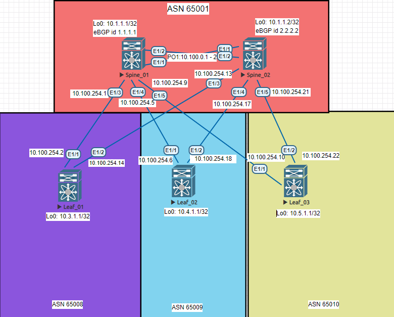

# Построение Underlay сети с использованием протокола BGP





# Конфигурация Spine_01

```python
feature ospf
feature bgp
feature lacp
feature bfd

route-map Leaf_AS permit 10
  match interface loopback0 
  match as-number 65005-65010 
route-map Leaf_peer permit 10
  match as-number 65001-65010 
vrf context management


interface port-channel1
  description to Spine_02
  no switchport
  bfd interval 100 min_rx 100 multiplier 2
  ip address 10.100.0.1/30
  ip router ospf 1 area 0.0.0.0

interface Ethernet1/1
  no switchport
  channel-group 1 mode active
  no shutdown

interface Ethernet1/2
  no switchport
  channel-group 1 mode active
  no shutdown

interface Ethernet1/3
  no switchport
  bfd interval 100 min_rx 100 multiplier 2
  ip address 10.100.254.1/30
  ip router ospf 1 area 0.0.0.1
  no shutdown

interface Ethernet1/4
  no switchport
  ip address 10.100.254.5/30
  ip router ospf 1 area 0.0.0.2
  no shutdown

interface Ethernet1/5
  no switchport
  ip address 10.100.254.9/30
  ip router ospf 1 area 0.0.0.3
  no shutdown

interface loopback0
  ip address 10.1.1.1/32
  ip router ospf 1 area 0.0.0.0

router ospf 1
  router-id 1.1.1.1

router bgp 65001
  router-id 1.1.1.1
  bestpath as-path multipath-relax
  reconnect-interval 10
  log-neighbor-changes
  address-family ipv4 unicast
    redistribute direct route-map Leaf_peer
    maximum-paths 10
  neighbor 10.1.1.2
    bfd
    remote-as 65001
    update-source loopback0
    timers 15 20
    address-family ipv4 unicast
  neighbor 10.0.0.0/8 remote-as route-map Leaf_AS
    update-source loopback0
    timers 6 9
    address-family ipv4 unicast
    
```

# Конфигурация Spine_02

```python

feature ospf
feature bgp
feature lacp
feature bfd

route-map Leaf_AS permit 10
  match as-number 65005-65010 
route-map Leaf_peer permit 10
  match interface loopback0 
  match as-number 65001-65010 
vrf context management


interface port-channel1
  no switchport
  bfd interval 100 min_rx 100 multiplier 2
  ip address 10.100.0.2/30
  ip router ospf 1 area 0.0.0.0

interface Ethernet1/1
  no switchport
  channel-group 1 mode active
  no shutdown

interface Ethernet1/2
  no switchport
  channel-group 1 mode active
  no shutdown

interface Ethernet1/3
  no switchport
  ip address 10.100.254.13/30
  ip router ospf 1 area 0.0.0.1
  no shutdown

interface Ethernet1/4
  no switchport
  ip address 10.100.254.17/30
  ip router ospf 1 area 0.0.0.2
  no shutdown

interface Ethernet1/5
  no switchport
  ip address 10.100.254.21/30
  ip router ospf 1 area 0.0.0.3
  no shutdown

interface loopback0
  ip address 10.1.1.2/32
  ip router ospf 1 area 0.0.0.0

router ospf 1
  router-id 2.2.2.2

router bgp 65001
  router-id 2.2.2.2
  reconnect-interval 10
  log-neighbor-changes
  address-family ipv4 unicast
    redistribute direct route-map Leaf_peer
    maximum-paths 10
  neighbor 10.1.1.1
    bfd
    remote-as 65001
    update-source loopback0
    timers 15 20
    address-family ipv4 unicast
  neighbor 10.0.0.0/8 remote-as route-map Leaf_AS
    update-source loopback0
    address-family ipv4 unicast

```
# Конфигурация Leaf_01

```python

route-map Leaf_peer permit 10
  match interface loopback0 
vrf context management


interface Vlan1

interface Vlan10
  ip address 192.168.10.1/24

interface Ethernet1/1
  no switchport
  bfd interval 100 min_rx 100 multiplier 2
  ip address 10.100.254.2/30
  ip router ospf 1 area 0.0.0.1
  no shutdown

interface Ethernet1/2
  no switchport
  ip address 10.100.254.14/30
  ip router ospf 1 area 0.0.0.1
  no shutdown

interface loopback0
  ip address 10.3.1.1/32
  ip router ospf 1 area 0.0.0.1

router ospf 1
  router-id 3.3.3.3
  
router bgp 65008
  router-id 3.3.3.3
  reconnect-interval 10
  log-neighbor-changes
  address-family ipv4 unicast
    redistribute direct route-map Leaf_peer
    maximum-paths 10
  template peer SPINES
    remote-as 65001
    update-source loopback0
    ebgp-multihop 3
    timers 6 9
    address-family ipv4 unicast
  neighbor 10.1.1.1
    inherit peer SPINES
  neighbor 10.1.1.2
    inherit peer SPINES
```

# Конфигурация Leaf_02

```python
route-map Leaf_peer permit 10
  match interface loopback0 
vrf context management


interface Ethernet1/1
  no switchport
  ip address 10.100.254.6/30
  ip router ospf 1 area 0.0.0.2
  no shutdown

interface Ethernet1/2
  no switchport
  ip address 10.100.254.18/30
  ip router ospf 1 area 0.0.0.2
  no shutdown

  interface loopback0
  ip address 10.4.1.1/32
  ip router ospf 1 area 0.0.0.2
icam monitor scale

cli alias name wr copy run start
line console
line vty
router ospf 1
  router-id 4.4.4.
  
router bgp 65009
  router-id 4.4.4.4
  reconnect-interval 10
  log-neighbor-changes
  address-family ipv4 unicast
    redistribute direct route-map Leaf_peer
    maximum-paths 10
  template peer SPINES
    remote-as 65001
    ebgp-multihop 3
    timers 6 9
    address-family ipv4 unicast
  neighbor 10.1.1.1
    inherit peer SPINES
  neighbor 10.1.1.2
    inherit peer SPINES


```

# Конфигурация Leaf_03

```python
route-map Leaf_peer permit 10
  match as-number 65001-65010 
vrf context management


interface Ethernet1/1
  no switchport
  ip address 10.100.254.10/30
  ip router ospf 1 area 0.0.0.3
  no shutdown

interface Ethernet1/2
  no switchport
  ip address 10.100.254.22/30
  ip router ospf 1 area 0.0.0.3
  no shutdown

  interface loopback0
  ip address 10.5.1.1/32
  ip router ospf 1 area 0.0.0.3
icam monitor scale

router ospf 1
  router-id 5.5.5.5

router bgp 65010
  router-id 5.5.5.5
  reconnect-interval 10
  log-neighbor-changes
  address-family ipv4 unicast
    redistribute direct route-map Leaf_peer
    maximum-paths 10
  template peer SPINES
    remote-as 65001
    update-source loopback0
    ebgp-multihop 3
    timers 6 9
    address-family ipv4 unicast
  neighbor 10.1.1.1
    inherit peer SPINES
  neighbor 10.1.1.2
    inherit peer SPINES


```


# Таблица маршрутизации BGP 

# SPINE_01

```python

   Network            Next Hop            Metric     LocPrf     Weight Path
*>r10.1.1.1/32        0.0.0.0                  0        100      32768 ?
*>i10.1.1.2/32        10.1.1.2                 0        100          0 ?
* i10.3.1.1/32        10.3.1.1                 0        100          0 65008 ?
*>e                   10.3.1.1                 0                     0 65008 ?
* i10.4.1.1/32        10.4.1.1                 0        100          0 65009 ?
*>e                   10.4.1.1                 0                     0 65009 ?
* i10.5.1.1/32        10.5.1.1                 0        100          0 65010 ?
*>e                   10.5.1.1                 0                     0 65010 ?
*>r10.100.0.0/30      0.0.0.0                  0        100      32768 ?
*>r10.100.254.0/30    0.0.0.0                  0        100      32768 ?
*>r10.100.254.4/30    0.0.0.0                  0        100      32768 ?
*>r10.100.254.8/30    0.0.0.0                  0        100      32768 ?
* e                   10.5.1.1                 0                     0 65010 ?
* i10.100.254.20/30   10.5.1.1                 0        100          0 65010 ?
*>e                   10.5.1.1                 0                     0 65010 ?

```
# SPINE_02

```python
sh ip bgp
 Network            Next Hop            Metric     LocPrf     Weight Path
*>i10.1.1.1/32        10.1.1.1                 0        100          0 ?
*>r10.1.1.2/32        0.0.0.0                  0        100      32768 ?
*>e10.3.1.1/32        10.3.1.1                 0                     0 65008 ?
* i                   10.3.1.1                 0        100          0 65008 ?
*>e10.4.1.1/32        10.4.1.1                 0                     0 65009 ?
* i                   10.4.1.1                 0        100          0 65009 ?
* i10.5.1.1/32        10.5.1.1                 0        100          0 65010 ?
*>e                   10.5.1.1                 0                     0 65010 ?
*>i10.100.0.0/30      10.1.1.1                 0        100          0 ?
*>i10.100.254.0/30    10.1.1.1                 0        100          0 ?
*>i10.100.254.4/30    10.1.1.1                 0        100          0 ?
*>i10.100.254.8/30    10.1.1.1                 0        100          0 ?
* e                   10.5.1.1                 0                     0 65010 ?
* i10.100.254.20/30   10.5.1.1                 0        100          0 65010 ?
*>e                   10.5.1.1                 0                     0 65010 ?

```

# Leaf_01

```python
   Network            Next Hop            Metric     LocPrf     Weight Path
*|e10.1.1.1/32        10.1.1.2                                       0 65001 ?
*>e                   10.1.1.1                 0                     0 65001 ?
*|e10.1.1.2/32        10.1.1.2                 0                     0 65001 ?
*>e                   10.1.1.1                                       0 65001 ?
*>r10.3.1.1/32        0.0.0.0                  0        100      32768 ?
*|e10.4.1.1/32        10.1.1.1                                       0 65001 650
09 ?
*>e                   10.1.1.2                                       0 65001 650
09 ?
*|e10.5.1.1/32        10.1.1.1                                       0 65001 650
10 ?
*>e                   10.1.1.2                                       0 65001 650
10 ?
*|e10.100.0.0/30      10.1.1.2                                       0 65001 ?
*>e                   10.1.1.1                 0                     0 65001 ?
*|e10.100.254.0/30    10.1.1.2                                       0 65001 ?
*>e                   10.1.1.1                 0                     0 65001 ?
*|e10.100.254.4/30    10.1.1.2                                       0 65001 ?
*>e                   10.1.1.1                 0                     0 65001 ?
*|e10.100.254.8/30    10.1.1.2                                       0 65001 ?
*>e                   10.1.1.1                 0                     0 65001 ?
*|e10.100.254.20/30   10.1.1.1                                       0 65001 650
10 ?
*>e                   10.1.1.2                                       0 65001 650
10 ?

```

# Leaf_02

```python
sh ip bgp
   Network            Next Hop            Metric     LocPrf     Weight Path
*|e10.1.1.1/32        10.1.1.1                 0                     0 65001 ?
*>e                   10.1.1.2                                       0 65001 ?
*|e10.1.1.2/32        10.1.1.1                                       0 65001 ?
*>e                   10.1.1.2                 0                     0 65001 ?
*|e10.3.1.1/32        10.1.1.1                                       0 65001 650
08 ?
*>e                   10.1.1.2                                       0 65001 650
08 ?
*>r10.4.1.1/32        0.0.0.0                  0        100      32768 ?
*|e10.5.1.1/32        10.1.1.1                                       0 65001 650
10 ?
*>e                   10.1.1.2                                       0 65001 650
10 ?
*|e10.100.0.0/30      10.1.1.1                 0                     0 65001 ?
*>e                   10.1.1.2                                       0 65001 ?
*|e10.100.254.0/30    10.1.1.1                 0                     0 65001 ?
*>e                   10.1.1.2                                       0 65001 ?
*|e10.100.254.4/30    10.1.1.1                 0                     0 65001 ?
*>e                   10.1.1.2                                       0 65001 ?
*|e10.100.254.8/30    10.1.1.1                 0                     0 65001 ?
*>e                   10.1.1.2                                       0 65001 ?
*|e10.100.254.20/30   10.1.1.1                                       0 65001 650
10 ?
*>e                   10.1.1.2                                       0 65001 650
10 ?

```

# Leaf_03

```python
sh ip bgp

   Network            Next Hop            Metric     LocPrf     Weight Path
*|e10.1.1.1/32        10.1.1.2                                       0 65001 ?
*>e                   10.1.1.1                 0                     0 65001 ?
*|e10.1.1.2/32        10.1.1.2                 0                     0 65001 ?
*>e                   10.1.1.1                                       0 65001 ?
*|e10.3.1.1/32        10.1.1.2                                       0 65001 650
08 ?
*>e                   10.1.1.1                                       0 65001 650
08 ?
*|e10.4.1.1/32        10.1.1.2                                       0 65001 650
09 ?
*>e                   10.1.1.1                                       0 65001 650
09 ?
*>r10.5.1.1/32        0.0.0.0                  0        100      32768 ?
*|e10.100.0.0/30      10.1.1.2                                       0 65001 ?
*>e                   10.1.1.1                 0                     0 65001 ?
*|e10.100.254.0/30    10.1.1.2                                       0 65001 ?
*>e                   10.1.1.1                 0                     0 65001 ?
*|e10.100.254.4/30    10.1.1.2                                       0 65001 ?
*>e                   10.1.1.1                 0                     0 65001 ?
*>r10.100.254.8/30    0.0.0.0                  0        100      32768 ?
* e                   10.1.1.2                                       0 65001 ?
* e                   10.1.1.1                 0                     0 65001 ?
*>r10.100.254.20/30   0.0.0.0                  0        100      32768 ?

```

# BGP SESSION

# SPINE_01

```python


Neighbor        V    AS MsgRcvd MsgSent   TblVer  InQ OutQ Up/Down  State/PfxRcd
10.1.1.2        4 65001   11766   11739      108    0    0 05:16:49 4         
10.3.1.1        4 65008     309     305      108    0    0 00:29:12 1         
10.4.1.1        4 65009       6       5      108    0    0 00:00:03 1         
10.5.1.1        4 65010     249     245      108    0    0 00:23:14 3         
```

# SPINE_02

```python
Neighbor        V    AS MsgRcvd MsgSent   TblVer  InQ OutQ Up/Down  State/PfxRcd
10.1.1.1        4 65001   11486   11599       76    0    0 05:18:54 9         
10.3.1.1        4 65008   16227   32393       76    0    0 00:30:38 1         
10.4.1.1        4 65009      25      44       76    0    0 00:01:59 1         
10.5.1.1        4 65010     259     510       76    0    0 00:25:19 3     

```
# Leaf_01

```python
Neighbor        V    AS MsgRcvd MsgSent   TblVer  InQ OutQ Up/Down  State/PfxRcd
10.1.1.1        4 65001     358     333      141    0    0 00:32:10 9         
10.1.1.2        4 65001     641     319      141    0    0 00:31:31 9   

```
# Leaf_2

```python
Neighbor        V    AS MsgRcvd MsgSent   TblVer  InQ OutQ Up/Down  State/PfxRcd
10.1.1.1        4 65001     328     309      199    0    0 00:03:41 9         
10.1.1.2        4 65001     596     302      199    0    0 00:03:31 9        
```

# Leaf_03

```python
Neighbor        V    AS MsgRcvd MsgSent   TblVer  InQ OutQ Up/Down  State/PfxRcd
10.1.1.1        4 65001     305     285      114    0    0 00:27:21 8         
10.1.1.2        4 65001     558     279      114    0    0 00:27:21 8  

```
