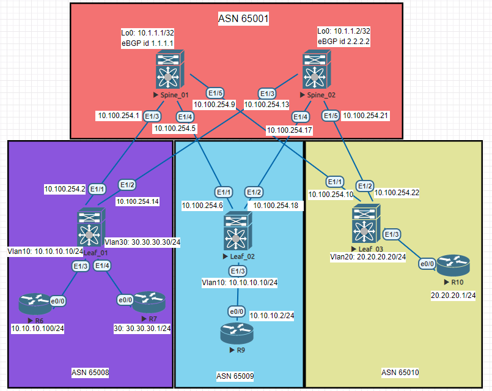
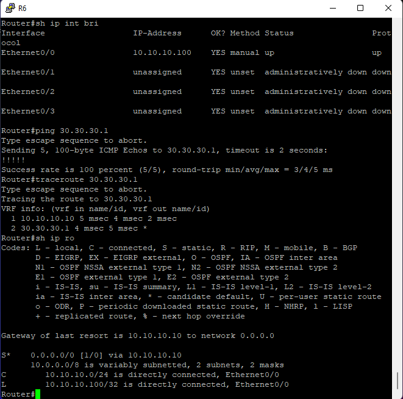
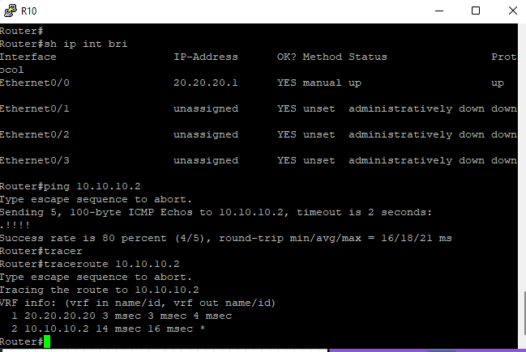

# Построение Overlay сети EVPN_L2 поверх Underlay OSPF Ipv4




полные файлы конфигураций в каталоге Config

# Основная конфигурация EVPN_L2 BGP

# Spine_01

```python

nv overlay evpn
feature ospf
feature bgp
eature bfd
feature nv overlay

router bgp 65001
  router-id 1.1.1.1
  timers bgp 3 9
  reconnect-interval 10
  log-neighbor-changes
  address-family l2vpn evpn
    maximum-paths 10
    retain route-target all
  neighbor 10.3.1.1
    remote-as 65008
    update-source loopback0
    ebgp-multihop 5
    address-family l2vpn evpn
      send-community
      send-community extended
      route-map NH_UNCHANGED out
      rewrite-evpn-rt-asn
  neighbor 10.4.1.1
    remote-as 65009
    update-source loopback0
    ebgp-multihop 5
    address-family l2vpn evpn
      send-community
      send-community extended
      route-map NH_UNCHANGED out
      rewrite-evpn-rt-asn
  neighbor 10.5.1.1
    remote-as 65010
    update-source loopback0
    ebgp-multihop 5
    address-family l2vpn evpn
      send-community
      send-community extended
      route-map NH_UNCHANGED out
      rewrite-evpn-rt-asn


```

# Spine_02

```python


nv overlay evpn
feature ospf
feature bgp
eature bfd
feature nv overlay

router bgp 65001
  router-id 2.2.2.2
  timers bgp 3 9
  reconnect-interval 10
  log-neighbor-changes
  address-family l2vpn evpn
    maximum-paths 10
    retain route-target all
  neighbor 10.3.1.1
    remote-as 65008
    update-source loopback0
    ebgp-multihop 5
    address-family l2vpn evpn
      send-community
      send-community extended
      route-map NH_UNCHANGED out
      rewrite-evpn-rt-asn
  neighbor 10.4.1.1
    remote-as 65009
    update-source loopback0
    ebgp-multihop 5
    address-family l2vpn evpn
      send-community
      send-community extended
      route-map NH_UNCHANGED out
      rewrite-evpn-rt-asn
  neighbor 10.5.1.1
    remote-as 65010
    update-source loopback0
    ebgp-multihop 5
    address-family l2vpn evpn
      send-community
      send-community extended
      route-map NH_UNCHANGED out
      rewrite-evpn-rt-asn


```

Так как используется eBGP для связности с Leaf коммутаторами не забываем команды :
1) rewrite-evpn-rt-asn (в конфиге bgp router)
2) retain route-target all (в конфиге bgp router)
3) Создаем route-map NH_UNCHANGED
  set ip next-hop unchanged
4) указываем route-map (в конфиге bgp router)


# Связность evpn L2 Spine_01 с Leaf коммутаторами
```python

sh bgp l2vpn evpn
Neighbor        V    AS MsgRcvd MsgSent   TblVer  InQ OutQ Up/Down  State/PfxRcd
10.3.1.1        4 65008   16326   16321       88    0    0 13:37:24 5         
10.4.1.1        4 65009   15061   15053       88    0    0 08:05:17 4         
10.5.1.1        4 65010   11117   11101       88    0    0 08:38:51 4 
```
# Связность evpn L2 Spine_02 Leaf коммутаторами
```python

sh bgp l2vpn evpn
Neighbor        V    AS MsgRcvd MsgSent   TblVer  InQ OutQ Up/Down  State/PfxRcd
10.3.1.1        4 65008    7323    7316       18    0    0 06:06:15 5         
10.4.1.1        4 65009    7320    7317       18    0    0 06:06:17 4         
10.5.1.1        4 65010    7324    7316       18    0    0 06:06:15 4
```

# Связность L2 evpn Spine 1
```python

Network            Next Hop            Metric     LocPrf     Weight Path
Route Distinguisher: 3.3.3.3:32777
*>e[2]:[0]:[0]:[48]:[aabb.cc00.6000]:[0]:[0.0.0.0]/216
                      100.100.100.1                                  0 65008 i
*>e[3]:[0]:[32]:[100.100.100.1]/88
                      100.100.100.1                                  0 65008 i
*>e[3]:[0]:[32]:[100.100.100.3]/88
                      100.100.100.3                                  0 65010 i

Route Distinguisher: 3.3.3.3:32787
*>e[2]:[0]:[0]:[48]:[aabb.cc00.a000]:[0]:[0.0.0.0]/216
                      100.100.100.3                                  0 65010 i
*>e[3]:[0]:[32]:[100.100.100.1]/88
                      100.100.100.1                                  0 65008 i
*>e[3]:[0]:[32]:[100.100.100.3]/88
                      100.100.100.3                                  0 65010 i

Route Distinguisher: 3.3.3.3:32797
*>e[2]:[0]:[0]:[48]:[aabb.cc00.7000]:[0]:[0.0.0.0]/216
                      100.100.100.1                                  0 65008 i
*>e[3]:[0]:[32]:[100.100.100.1]/88
                      100.100.100.1                                  0 65008 i
*>e[3]:[0]:[32]:[100.100.100.3]/88
                      100.100.100.3                                  0 65010 i

Route Distinguisher: 4.4.4.4:32777
*>e[2]:[0]:[0]:[48]:[aabb.cc00.9000]:[0]:[0.0.0.0]/216
                      100.100.100.2                                  0 65009 i
*>e[3]:[0]:[32]:[100.100.100.2]/88
                      100.100.100.2                                  0 65009 i

Route Distinguisher: 4.4.4.4:32787
*>e[3]:[0]:[32]:[100.100.100.2]/88
                      100.100.100.2                                  0 65009 i

Route Distinguisher: 4.4.4.4:32797
*>e[3]:[0]:[32]:[100.100.100.2]/88
                      100.100.100.2                                  0 65009 i
```

# Связность L2 evpn Spine 2
```python
   Network            Next Hop            Metric     LocPrf     Weight Path
Route Distinguisher: 3.3.3.3:32777
*>e[2]:[0]:[0]:[48]:[aabb.cc00.6000]:[0]:[0.0.0.0]/216
                      100.100.100.1                                  0 65008 i
*>e[3]:[0]:[32]:[100.100.100.1]/88
                      100.100.100.1                                  0 65008 i
*>e[3]:[0]:[32]:[100.100.100.3]/88
                      100.100.100.3                                  0 65010 i

Route Distinguisher: 3.3.3.3:32787
*>e[2]:[0]:[0]:[48]:[aabb.cc00.a000]:[0]:[0.0.0.0]/216
                      100.100.100.3                                  0 65010 i
*>e[3]:[0]:[32]:[100.100.100.1]/88
                      100.100.100.1                                  0 65008 i
*>e[3]:[0]:[32]:[100.100.100.3]/88
                      100.100.100.3                                  0 65010 i

Route Distinguisher: 3.3.3.3:32797
*>e[2]:[0]:[0]:[48]:[aabb.cc00.7000]:[0]:[0.0.0.0]/216
                      100.100.100.1                                  0 65008 i
*>e[3]:[0]:[32]:[100.100.100.1]/88
                      100.100.100.1                                  0 65008 i
*>e[3]:[0]:[32]:[100.100.100.3]/88
                      100.100.100.3                                  0 65010 i

Route Distinguisher: 4.4.4.4:32777
*>e[2]:[0]:[0]:[48]:[aabb.cc00.9000]:[0]:[0.0.0.0]/216
                      100.100.100.2                                  0 65009 i
*>e[3]:[0]:[32]:[100.100.100.2]/88
                      100.100.100.2                                  0 65009 i

Route Distinguisher: 4.4.4.4:32787
*>e[3]:[0]:[32]:[100.100.100.2]/88
                      100.100.100.2                                  0 65009 i

Route Distinguisher: 4.4.4.4:32797
*>e[3]:[0]:[32]:[100.100.100.2]/88
                      100.100.100.2   


```

# Основная конфигурация EVPN_L2 BGP
# Leaf_01
```python

nv overlay evpn
feature ospf
feature bgp
feature interface-vlan
feature vn-segment-vlan-based
feature bfd
feature nv overlay

vlan 1,10,20,30,222
vlan 10
  name VLAN_10
  vn-segment 10010
vlan 20
  name VLAN_20
  vn-segment 10020
vlan 30
  name VLAN_30
  vn-segment 10030
vlan 222
  vn-segment 100222

vrf context CCCP
  vni 10222
  rd auto
  address-family ipv4 unicast
    route-target both auto

interface Vlan10
  no shutdown
  vrf member CCCP
  ip address 10.10.10.10/24

interface Vlan20
  no shutdown
  vrf member CCCP
  ip address 20.20.20.20/24

interface Vlan30
  no shutdown
  vrf member CCCP
  ip address 30.30.30.30/24

interface Vlan222
  no shutdown
  vrf member CCCP
  ip forward

interface nve1
  no shutdown
  host-reachability protocol bgp
  source-interface loopback100
  member vni 10010
    ingress-replication protocol bgp
  member vni 10020
    ingress-replication protocol bgp
  member vni 10030
    ingress-replication protocol bgp
  member vni 100222 associate-vrf      

interface loopback100
  ip address 100.100.100.1/32
  ip router ospf 1 area 0.0.0.1
icam monitor scale

router bgp 65008
  router-id 3.3.3.3
  timers bgp 3 9
  reconnect-interval 10
  log-neighbor-changes
  address-family l2vpn evpn
    maximum-paths 10
  template peer SPINES
    bfd
    remote-as 65001
    update-source loopback0
    ebgp-multihop 2
    timers 3 9
    address-family l2vpn evpn
      send-community
      send-community extended
      rewrite-evpn-rt-asn
  neighbor 10.1.1.1
    inherit peer SPINES
  neighbor 10.1.1.2
    inherit peer SPINES
evpn
  vni 10010 l2
    rd auto
    route-target import auto
    route-target export auto
  vni 10020 l2
    rd auto
    route-target import auto
    route-target export auto
  vni 10030 l2
    rd auto
    route-target import auto
    route-target export auto

```

# Leaf_02
```python

nv overlay evpn
feature ospf
feature bgp
feature interface-vlan
feature vn-segment-vlan-based
feature bfd
feature nv overlay

vlan 1,10,20,30,222
vlan 10
  name VLAN_10
  vn-segment 10010
vlan 20
  name VLAN_20
  vn-segment 10020
vlan 30
  name VLAN_30
  vn-segment 10030
vlan 222
  vn-segment 100222

vrf context CCCP
  vni 10222
  rd auto
  address-family ipv4 unicast
    route-target both auto

interface Vlan10
  no shutdown
  vrf member CCCP
  ip address 10.10.10.10/24

interface Vlan20
  no shutdown
  vrf member CCCP
  ip address 20.20.20.20/24

interface Vlan30
  no shutdown
  vrf member CCCP
  ip address 30.30.30.30/24

interface Vlan222
  no shutdown
  vrf member CCCP
  ip forward

interface nve1
  no shutdown
  host-reachability protocol bgp
  source-interface loopback100
  member vni 10010
    ingress-replication protocol bgp
  member vni 10020
    ingress-replication protocol bgp
  member vni 10030
    ingress-replication protocol bgp
  member vni 100222 associate-vrf

interface loopback100
  ip address 100.100.100.2/32
  ip router ospf 1 area 0.0.0.2

router bgp 65009
  router-id 4.4.4.4
  timers bgp 3 9
  reconnect-interval 10
  log-neighbor-changes
  address-family l2vpn evpn
    maximum-paths 10
  template peer SPINES
    bfd
    remote-as 65001
    update-source loopback0
    ebgp-multihop 2
    timers 3 9
    address-family l2vpn evpn
      send-community
      send-community extended
      rewrite-evpn-rt-asn
  neighbor 10.1.1.1
    inherit peer SPINES
  neighbor 10.1.1.2
    inherit peer SPINES
evpn
  vni 10010 l2
    rd auto
    route-target import auto
    route-target export auto
  vni 10020 l2
    rd auto
    route-target import auto
    route-target export auto
  vni 10030 l2
    rd auto
    route-target import auto
    route-target export auto
```
# Leaf_03
```python
nv overlay evpn
feature ospf
feature bgp
feature interface-vlan
feature vn-segment-vlan-based
feature bfd
feature nv overlay

vlan 1,10,20,30,222
vlan 10
  name VLAN_10
  vn-segment 10010
vlan 20
  name VLAN_20
  vn-segment 10020
vlan 30
  name VLAN_30
  vn-segment 10030
vlan 222
  vn-segment 100222

vrf context CCCP
  vni 10222
  rd auto
  address-family ipv4 unicast
    route-target both auto

interface Vlan10
  no shutdown
  vrf member CCCP
  ip address 10.10.10.10/24

interface Vlan20
  no shutdown
  vrf member CCCP
  ip address 20.20.20.20/24

interface Vlan30
  no shutdown
  vrf member CCCP
  ip address 30.30.30.30/24

interface Vlan222
  no shutdown
  vrf member CCCP
  ip forward

interface nve1
  no shutdown
  host-reachability protocol bgp
  source-interface loopback100
  member vni 10010
    ingress-replication protocol bgp
  member vni 10020
    ingress-replication protocol bgp
  member vni 10030
    ingress-replication protocol bgp
  member vni 100222 associate-vrf

router bgp 65010
  router-id 3.3.3.3
  timers bgp 3 9
  reconnect-interval 10
  log-neighbor-changes
  address-family l2vpn evpn
    maximum-paths 10
  template peer SPINES
    bfd
    remote-as 65001
    update-source loopback0
    ebgp-multihop 2
    timers 3 9
    address-family l2vpn evpn
      send-community
      send-community extended
      rewrite-evpn-rt-asn
  neighbor 10.1.1.1
    inherit peer SPINES
  neighbor 10.1.1.2
    inherit peer SPINES
evpn
  vni 10010 l2
    rd auto
    route-target import auto
    route-target export auto
  vni 10020 l2
    rd auto
    route-target import auto
    route-target export auto
  vni 10030 l2
    rd auto
    route-target import auto
    route-target export auto
```
# Связность L2 evpn Leaf_01 
```python
sh bgp l2vpn evpn 

   Network            Next Hop            Metric     LocPrf     Weight Path
Route Distinguisher: 3.3.3.3:32777    (L2VNI 10010)
*>l[2]:[0]:[0]:[48]:[aabb.cc00.6000]:[0]:[0.0.0.0]/216
                      100.100.100.1                     100      32768 i
*>e[2]:[0]:[0]:[48]:[aabb.cc00.9000]:[0]:[0.0.0.0]/216
                      100.100.100.2                                  0 65001 650
09 i
*>l[3]:[0]:[32]:[100.100.100.1]/88
                      100.100.100.1                     100      32768 i
*>e[3]:[0]:[32]:[100.100.100.2]/88
                      100.100.100.2                                  0 65001 650
09 i
* e[3]:[0]:[32]:[100.100.100.3]/88
                      100.100.100.3                                  0 65001 650
10 i
*>e                   100.100.100.3                                  0 65001 650
10 i

Route Distinguisher: 3.3.3.3:32787    (L2VNI 10020)
* e[2]:[0]:[0]:[48]:[aabb.cc00.a000]:[0]:[0.0.0.0]/216
                      100.100.100.3                                  0 65001 650
10 i
*>e                   100.100.100.3                                  0 65001 650
10 i
*>l[3]:[0]:[32]:[100.100.100.1]/88
                      100.100.100.1                     100      32768 i
*>e[3]:[0]:[32]:[100.100.100.2]/88
                      100.100.100.2                                  0 65001 650
09 i
* e[3]:[0]:[32]:[100.100.100.3]/88
                      100.100.100.3                                  0 65001 650
10 i
*>e                   100.100.100.3                                  0 65001 650
10 i

Route Distinguisher: 3.3.3.3:32797    (L2VNI 10030)
*>l[2]:[0]:[0]:[48]:[aabb.cc00.7000]:[0]:[0.0.0.0]/216
                      100.100.100.1                     100      32768 i
*>l[3]:[0]:[32]:[100.100.100.1]/88
                      100.100.100.1                     100      32768 i
*>e[3]:[0]:[32]:[100.100.100.2]/88
                      100.100.100.2                                  0 65001 650
09 i
* e[3]:[0]:[32]:[100.100.100.3]/88
                      100.100.100.3                                  0 65001 650
10 i
*>e                   100.100.100.3                                  0 65001 650
10 i

Route Distinguisher: 4.4.4.4:32777
* e[2]:[0]:[0]:[48]:[aabb.cc00.9000]:[0]:[0.0.0.0]/216
                      100.100.100.2                                  0 65001 650
09 i
*>e                   100.100.100.2                                  0 65001 650
09 i
* e[3]:[0]:[32]:[100.100.100.2]/88
                      100.100.100.2                                  0 65001 650
09 i
*>e                   100.100.100.2                                  0 65001 650
09 i

Route Distinguisher: 4.4.4.4:32787
* e[3]:[0]:[32]:[100.100.100.2]/88
                      100.100.100.2                                  0 65001 650
09 i
*>e                   100.100.100.2                                  0 65001 650
09 i

Route Distinguisher: 4.4.4.4:32797
* e[3]:[0]:[32]:[100.100.100.2]/88
                      100.100.100.2                                  0 65001 650
09 i
*>e                   100.100.100.2                                  0 65001 650
09 i

```

# Связность L2 evpn Leaf_02
```python
sh bgp l2vpn evpn 
   Network            Next Hop            Metric     LocPrf     Weight Path
Route Distinguisher: 3.3.3.3:32777
* e[2]:[0]:[0]:[48]:[aabb.cc00.6000]:[0]:[0.0.0.0]/216
                      100.100.100.1                                  0 65001 650
08 i
*>e                   100.100.100.1                                  0 65001 650
08 i
* e[3]:[0]:[32]:[100.100.100.1]/88
                      100.100.100.1                                  0 65001 650
08 i
*>e                   100.100.100.1                                  0 65001 650
08 i
* e[3]:[0]:[32]:[100.100.100.3]/88
                      100.100.100.3                                  0 65001 650
10 i
*>e                   100.100.100.3                                  0 65001 650
10 i

Route Distinguisher: 3.3.3.3:32787
* e[2]:[0]:[0]:[48]:[aabb.cc00.a000]:[0]:[0.0.0.0]/216
                      100.100.100.3                                  0 65001 650
10 i
*>e                   100.100.100.3                                  0 65001 650
10 i
* e[3]:[0]:[32]:[100.100.100.1]/88
                      100.100.100.1                                  0 65001 650
08 i
*>e                   100.100.100.1                                  0 65001 650
08 i
* e[3]:[0]:[32]:[100.100.100.3]/88
                      100.100.100.3                                  0 65001 650
10 i
*>e                   100.100.100.3                                  0 65001 650
10 i

Route Distinguisher: 3.3.3.3:32797
* e[2]:[0]:[0]:[48]:[aabb.cc00.7000]:[0]:[0.0.0.0]/216
                      100.100.100.1                                  0 65001 650
08 i
*>e                   100.100.100.1                                  0 65001 650
08 i
* e[3]:[0]:[32]:[100.100.100.1]/88
                      100.100.100.1                                  0 65001 650
08 i
*>e                   100.100.100.1                                  0 65001 650
08 i
* e[3]:[0]:[32]:[100.100.100.3]/88
                      100.100.100.3                                  0 65001 650
10 i
*>e                   100.100.100.3                                  0 65001 650
10 i

Route Distinguisher: 4.4.4.4:32777    (L2VNI 10010)
*>e[2]:[0]:[0]:[48]:[aabb.cc00.6000]:[0]:[0.0.0.0]/216
                      100.100.100.1                                  0 65001 650
08 i
*>l[2]:[0]:[0]:[48]:[aabb.cc00.9000]:[0]:[0.0.0.0]/216
                      100.100.100.2                     100      32768 i
*>e[3]:[0]:[32]:[100.100.100.1]/88
                      100.100.100.1                                  0 65001 650
08 i
*>l[3]:[0]:[32]:[100.100.100.2]/88
                      100.100.100.2                     100      32768 i
*>e[3]:[0]:[32]:[100.100.100.3]/88
                      100.100.100.3                                  0 65001 650
10 i

Route Distinguisher: 4.4.4.4:32787    (L2VNI 10020)
*>e[2]:[0]:[0]:[48]:[aabb.cc00.a000]:[0]:[0.0.0.0]/216
                      100.100.100.3                                  0 65001 650
10 i
*>e[3]:[0]:[32]:[100.100.100.1]/88
                      100.100.100.1                                  0 65001 650
08 i
*>l[3]:[0]:[32]:[100.100.100.2]/88
                      100.100.100.2                     100      32768 i
*>e[3]:[0]:[32]:[100.100.100.3]/88
                      100.100.100.3                                  0 65001 650
10 i

Route Distinguisher: 4.4.4.4:32797    (L2VNI 10030)
*>e[2]:[0]:[0]:[48]:[aabb.cc00.7000]:[0]:[0.0.0.0]/216
                      100.100.100.1                                  0 65001 650
08 i
*>e[3]:[0]:[32]:[100.100.100.1]/88
                      100.100.100.1                                  0 65001 650
08 i
*>l[3]:[0]:[32]:[100.100.100.2]/88
                      100.100.100.2                     100      32768 i
*>e[3]:[0]:[32]:[100.100.100.3]/88
                      100.100.100.3                                  0 65001 650
10 i
```

# Связность L2 evpn Leaf_03
```python
sh bgp l2vpn evpn 
   Network            Next Hop            Metric     LocPrf     Weight Path
Route Distinguisher: 3.3.3.3:32777    (L2VNI 10010)
* e[2]:[0]:[0]:[48]:[aabb.cc00.6000]:[0]:[0.0.0.0]/216
                      100.100.100.1                                  0 65001 650
08 i
*>e                   100.100.100.1                                  0 65001 650
08 i
*>e[2]:[0]:[0]:[48]:[aabb.cc00.9000]:[0]:[0.0.0.0]/216
                      100.100.100.2                                  0 65001 650
09 i
* e[3]:[0]:[32]:[100.100.100.1]/88
                      100.100.100.1                                  0 65001 650
08 i
*>e                   100.100.100.1                                  0 65001 650
08 i
*>e[3]:[0]:[32]:[100.100.100.2]/88
                      100.100.100.2                                  0 65001 650
09 i
*>l[3]:[0]:[32]:[100.100.100.3]/88
                      100.100.100.3                     100      32768 i

Route Distinguisher: 3.3.3.3:32787    (L2VNI 10020)
*>l[2]:[0]:[0]:[48]:[aabb.cc00.a000]:[0]:[0.0.0.0]/216
                      100.100.100.3                     100      32768 i
* e[3]:[0]:[32]:[100.100.100.1]/88
                      100.100.100.1                                  0 65001 650
08 i
*>e                   100.100.100.1                                  0 65001 650
08 i
*>e[3]:[0]:[32]:[100.100.100.2]/88
                      100.100.100.2                                  0 65001 650
09 i
*>l[3]:[0]:[32]:[100.100.100.3]/88
                      100.100.100.3                     100      32768 i

Route Distinguisher: 3.3.3.3:32797    (L2VNI 10030)
* e[2]:[0]:[0]:[48]:[aabb.cc00.7000]:[0]:[0.0.0.0]/216
                      100.100.100.1                                  0 65001 650
08 i
*>e                   100.100.100.1                                  0 65001 650
08 i
* e[3]:[0]:[32]:[100.100.100.1]/88
                      100.100.100.1                                  0 65001 650
08 i
*>e                   100.100.100.1                                  0 65001 650
08 i
*>e[3]:[0]:[32]:[100.100.100.2]/88
                      100.100.100.2                                  0 65001 650
09 i
*>l[3]:[0]:[32]:[100.100.100.3]/88
                      100.100.100.3                     100      32768 i

Route Distinguisher: 4.4.4.4:32777
* e[2]:[0]:[0]:[48]:[aabb.cc00.9000]:[0]:[0.0.0.0]/216
                      100.100.100.2                                  0 65001 650
09 i
*>e                   100.100.100.2                                  0 65001 650
09 i
* e[3]:[0]:[32]:[100.100.100.2]/88
                      100.100.100.2                                  0 65001 650
09 i
*>e                   100.100.100.2                                  0 65001 650
09 i

Route Distinguisher: 4.4.4.4:32787
* e[3]:[0]:[32]:[100.100.100.2]/88
                      100.100.100.2                                  0 65001 650
09 i
*>e                   100.100.100.2                                  0 65001 650
09 i

Route Distinguisher: 4.4.4.4:32797
* e[3]:[0]:[32]:[100.100.100.2]/88
                      100.100.100.2                                  0 65001 650
09 i
*>e                   100.100.100.2                                  0 65001 650
09 i

```

# Таблица мак адресов 
Leaf_01
```python
  VLAN     MAC Address      Type      age     Secure NTFY Ports
---------+-----------------+--------+---------+------+----+------------------
*   10     aabb.cc00.6000   dynamic  0         F      F    Eth1/3
C   10     aabb.cc00.9000   dynamic  0         F      F    nve1(100.100.100.2)
G   10     5004.0000.1b08   static   -         F      F    sup-eth1(R)

   VLAN     MAC Address      Type      age     Secure NTFY Ports
---------+-----------------+--------+---------+------+----+------------------
C   20     aabb.cc00.a000   dynamic  0         F      F    nve1(100.100.100.3)
G   20     5004.0000.1b08   static   -         F      F    sup-eth1(R)

   VLAN     MAC Address      Type      age     Secure NTFY Ports
---------+-----------------+--------+---------+------+----+------------------
*   30     aabb.cc00.7000   dynamic  0         F      F    Eth1/4
G   30     5004.0000.1b08   static   -         F      F    sup-eth1(R)

```
Leaf_02
```python
VLAN     MAC Address      Type      age     Secure NTFY Ports
---------+-----------------+--------+---------+------+----+------------------
C   10     aabb.cc00.6000   dynamic  0         F      F    nve1(100.100.100.1)
*   10     aabb.cc00.9000   dynamic  0         F      F    Eth1/3
G   10     500c.0000.1b08   static   -         F      F    sup-eth1(R)

 VLAN     MAC Address      Type      age     Secure NTFY Ports
---------+-----------------+--------+---------+------+----+------------------
C   20     aabb.cc00.a000   dynamic  0         F      F    nve1(100.100.100.3)
G   20     500c.0000.1b08   static   -         F      F    sup-eth1(R)
Leaf_02# sh mac ad vl 30

 VLAN     MAC Address      Type      age     Secure NTFY Ports
---------+-----------------+--------+---------+------+----+------------------
C   30     aabb.cc00.7000   dynamic  0         F      F    nve1(100.100.100.1)
G   30     500c.0000.1b08   static   -         F      F    sup-eth1(R)
```


Leaf_03
```python
  VLAN     MAC Address      Type      age     Secure NTFY Ports
---------+-----------------+--------+---------+------+----+------------------
C   10     aabb.cc00.6000   dynamic  0         F      F    nve1(100.100.100.1)
C   10     aabb.cc00.9000   dynamic  0         F      F    nve1(100.100.100.2)
G   10     5005.0000.1b08   static   -         F      F    sup-eth1(R)

 VLAN     MAC Address      Type      age     Secure NTFY Ports
---------+-----------------+--------+---------+------+----+------------------
*   20     aabb.cc00.a000   dynamic  0         F      F    Eth1/3
G   20     5005.0000.1b08   static   -         F      F    sup-eth1(R)

 VLAN     MAC Address      Type      age     Secure NTFY Ports
---------+-----------------+--------+---------+------+----+------------------
C   30     aabb.cc00.7000   dynamic  0         F      F    nve1(100.100.100.1)
G   30     5005.0000.1b08   static   -         F      F    sup-eth1(R)

```
# Работа маршрутизации L2 evpn

