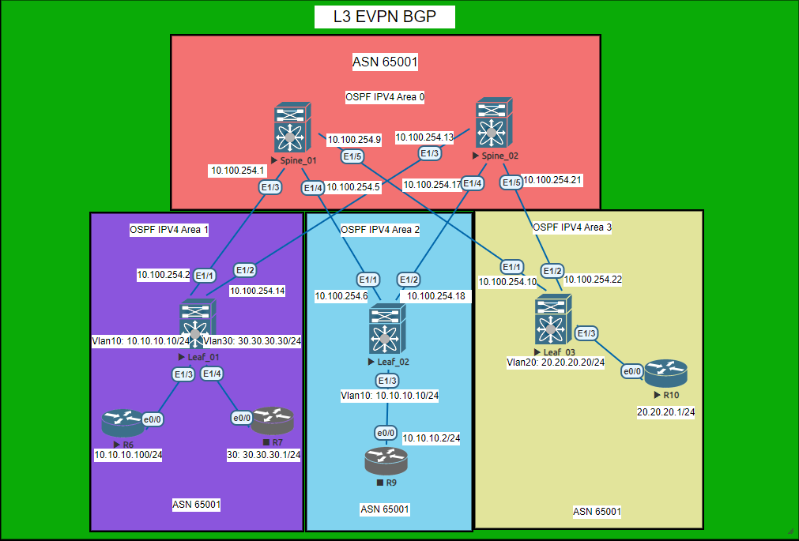
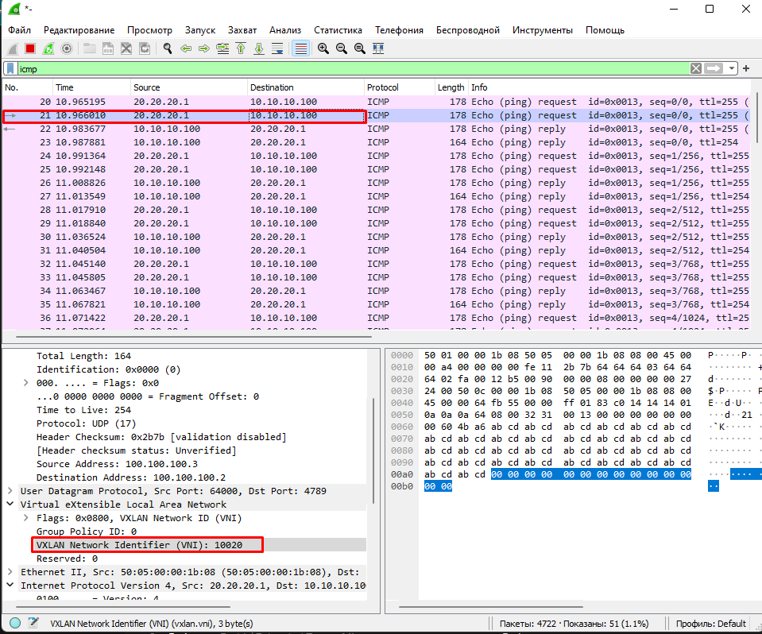
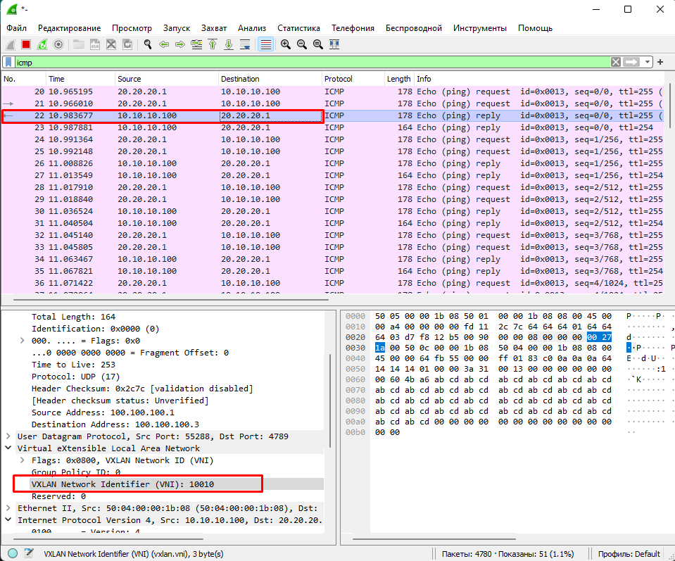
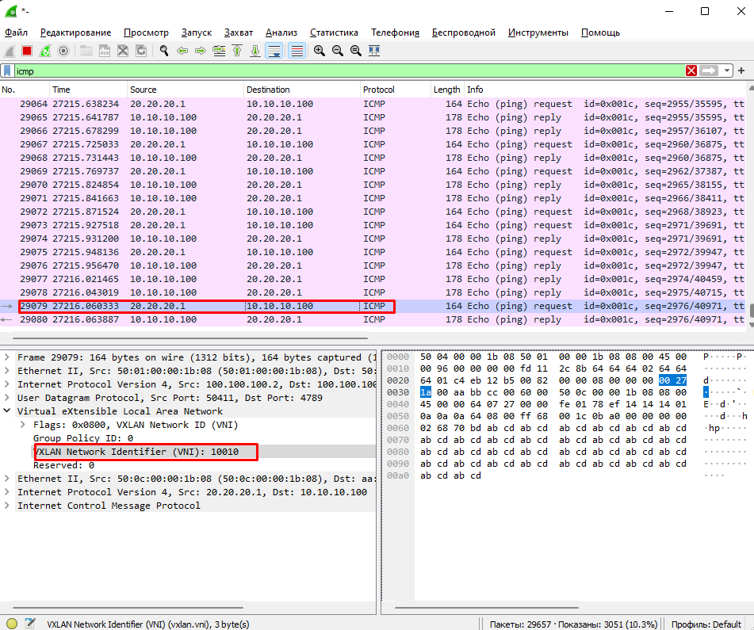
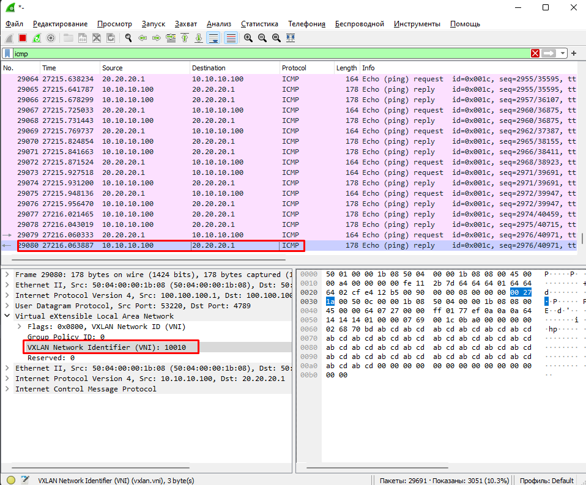

# Построение Overlay сети VxLAN EVPN_L3 поверх Underlay OSPF Ipv4



# Работа маршрутизации L3 asymmetric evpn
принципиалная разница от L2 Type2 MAC маршрутизации в добавлении маршрута TYPE2 MAC-IP
```python
*>e[2]:[0]:[0]:[48]:[aabb.cc00.6000]:[32]:[10.10.10.100]/248
*>e[2]:[0]:[0]:[48]:[aabb.cc00.a000]:[32]:[20.20.20.1]/248

```

Отправка icmp пакета в vni 10020


Прием icmp пакета в vni 10010


# Работа маршрутизации L3 symmetric evpn

```python
Leaf_01# sh bgp l2 evpn  vrf CCCP
Route Distinguisher: 3.3.3.3:4    (L3VNI 100222)
*>i[2]:[0]:[0]:[48]:[aabb.cc00.a000]:[32]:[20.20.20.1]/272
                      100.100.100.3                     100          0 i


Leaf_03# sh bgp l2 evpn vrf CCCP
Route Distinguisher: 5.5.5.5:3    (L3VNI 100222)
*>i[2]:[0]:[0]:[48]:[aabb.cc00.6000]:[32]:[10.10.10.100]/272
                      100.100.100.1                     100          0 i

```

При Симметричном маршруте все ходит в одном VNI







полные файлы конфигураций в каталоге Config

# Основная конфигурация EVPN_L2 BGP

# Spine_01

```python

nv overlay evpn
feature ospf
feature bgp
eature bfd
feature nv overlay

router bgp 65001
  router-id 1.1.1.1
  timers bgp 3 9
  reconnect-interval 10
  log-neighbor-changes
  address-family l2vpn evpn
    maximum-paths 10
    retain route-target all
  neighbor 10.3.1.1
    remote-as 65008
    update-source loopback0
    ebgp-multihop 5
    address-family l2vpn evpn
      send-community
      send-community extended
      route-map NH_UNCHANGED out
      rewrite-evpn-rt-asn
  neighbor 10.4.1.1
    remote-as 65009
    update-source loopback0
    ebgp-multihop 5
    address-family l2vpn evpn
      send-community
      send-community extended
      route-map NH_UNCHANGED out
      rewrite-evpn-rt-asn
  neighbor 10.5.1.1
    remote-as 65010
    update-source loopback0
    ebgp-multihop 5
    address-family l2vpn evpn
      send-community
      send-community extended
      route-map NH_UNCHANGED out
      rewrite-evpn-rt-asn


```

# Spine_02

```python


nv overlay evpn
feature ospf
feature bgp
eature bfd
feature nv overlay

router bgp 65001
  router-id 2.2.2.2
  timers bgp 3 9
  reconnect-interval 10
  log-neighbor-changes
  address-family l2vpn evpn
    maximum-paths 10
    retain route-target all
  neighbor 10.3.1.1
    remote-as 65008
    update-source loopback0
    ebgp-multihop 5
    address-family l2vpn evpn
      send-community
      send-community extended
      route-map NH_UNCHANGED out
      rewrite-evpn-rt-asn
  neighbor 10.4.1.1
    remote-as 65009
    update-source loopback0
    ebgp-multihop 5
    address-family l2vpn evpn
      send-community
      send-community extended
      route-map NH_UNCHANGED out
      rewrite-evpn-rt-asn
  neighbor 10.5.1.1
    remote-as 65010
    update-source loopback0
    ebgp-multihop 5
    address-family l2vpn evpn
      send-community
      send-community extended
      route-map NH_UNCHANGED out
      rewrite-evpn-rt-asn


```

# Связность evpn L2 Spine_01 с Leaf коммутаторами
```python

sh bgp l2vpn evpn
Neighbor        V    AS MsgRcvd MsgSent   TblVer  InQ OutQ Up/Down  State/PfxRcd
10.3.1.1        4 65008   16326   16321       88    0    0 13:37:24 5         
10.4.1.1        4 65009   15061   15053       88    0    0 08:05:17 4         
10.5.1.1        4 65010   11117   11101       88    0    0 08:38:51 4 
```
# Связность evpn L2 Spine_02 Leaf коммутаторами
```python

sh bgp l2vpn evpn
Neighbor        V    AS MsgRcvd MsgSent   TblVer  InQ OutQ Up/Down  State/PfxRcd
10.3.1.1        4 65008    7323    7316       18    0    0 06:06:15 5         
10.4.1.1        4 65009    7320    7317       18    0    0 06:06:17 4         
10.5.1.1        4 65010    7324    7316       18    0    0 06:06:15 4
```


# Основная конфигурация EVPN_L3 asymmetryc
# Leaf_01
```python

nv overlay evpn
feature ospf
feature bgp
feature interface-vlan
feature vn-segment-vlan-based
feature bfd
feature nv overlay

fabric forwarding anycast-gateway-mac 0000.1111.2222

vlan 1,10,20,30,222
vlan 10
  name VLAN_10
  vn-segment 10010
vlan 20
  name VLAN_20
  vn-segment 10020
vlan 30
  name VLAN_30
  vn-segment 10030

vrf context CCCP
    rd auto
    route-target both auto

interface Vlan10
  no shutdown
  vrf member CCCP
  ip address 10.10.10.10/24
  fabric forwarding mode anycast-gateway


interface Vlan20
  no shutdown
  vrf member CCCP
  ip address 20.20.20.20/24
  fabric forwarding mode anycast-gateway


interface Vlan30
  no shutdown
  vrf member CCCP
  ip address 30.30.30.30/24
  fabric forwarding mode anycast-gateway


interface nve1
  no shutdown
  host-reachability protocol bgp
  source-interface loopback100
  member vni 10010
    ingress-replication protocol bgp
  member vni 10020
    ingress-replication protocol bgp
  member vni 10030
    

interface loopback100
  ip address 100.100.100.1/32
  ip router ospf 1 area 0.0.0.1
icam monitor scale

router bgp 65001
  router-id 3.3.3.3
  timers bgp 3 9
  reconnect-interval 10
  log-neighbor-changes
  address-family l2vpn evpn
    maximum-paths 10
  template peer SPINES
    bfd
    remote-as 65001
    update-source loopback0
    timers 6 9
    address-family l2vpn evpn
      send-community
      send-community extended
  neighbor 10.1.1.1
    inherit peer SPINES
  neighbor 10.1.1.2
    inherit peer SPINES
evpn
  vni 10010 l2
    rd auto
    route-target import auto
    route-target export auto
  vni 10030 l2
    rd auto
    route-target import auto
    route-target export auto
  vni 100222 l2
    rd auto
    route-target import auto
    route-target export auto
```


# Leaf_03
```python
nv overlay evpn
feature ospf
feature bgp
feature interface-vlan
feature vn-segment-vlan-based
feature bfd
feature nv overlay

fabric forwarding anycast-gateway-mac 0000.1111.2222

vlan 1,10,20,30,222
vlan 10
  name VLAN_10
  vn-segment 10010
vlan 20
  name VLAN_20
  vn-segment 10020
vlan 30
  name VLAN_30
  vn-segment 10030

vrf context CCCP
  rd auto
  address-family ipv4 unicast
    route-target both auto

interface Vlan10
  no shutdown
  vrf member CCCP
  ip address 10.10.10.10/24
  fabric forwarding mode anycast-gateway


interface Vlan20
  no shutdown
  vrf member CCCP
  ip address 20.20.20.20/24
  fabric forwarding mode anycast-gateway


interface Vlan30
  no shutdown
  vrf member CCCP
  ip address 30.30.30.30/24
  fabric forwarding mode anycast-gateway


interface nve1
  no shutdown
  host-reachability protocol bgp
  source-interface loopback100
  member vni 10010
    ingress-replication protocol bgp
  member vni 10020
    ingress-replication protocol bgp
  member vni 10030
    ingress-replication protocol bgp
  
router bgp 65010
  router-id 3.3.3.3
  timers bgp 3 9
  reconnect-interval 10
  log-neighbor-changes
  address-family l2vpn evpn
    maximum-paths 10
  template peer SPINES
    bfd
    remote-as 65001
    update-source loopback0
    ebgp-multihop 2
    timers 3 9
    address-family l2vpn evpn
      send-community
      send-community extended
      rewrite-evpn-rt-asn
  neighbor 10.1.1.1
    inherit peer SPINES
  neighbor 10.1.1.2
    inherit peer SPINES
evpn
  vni 10010 l2
    rd auto
    route-target import auto
    route-target export auto
  vni 10020 l2
    rd auto
    route-target import auto
    route-target export auto
  vni 10030 l2
    rd auto
    route-target import auto
    route-target export auto
```
# Маршруты L3 asymmetric evpn Leaf_01 
```python
sh bgp l2vpn evpn 

Network            Next Hop            Metric     LocPrf     Weight Path
Route Distinguisher: 3.3.3.3:32777    (L2VNI 10010)
*>l[2]:[0]:[0]:[48]:[aabb.cc00.6000]:[0]:[0.0.0.0]/216
                      100.100.100.1                     100      32768 i
*>l[2]:[0]:[0]:[48]:[aabb.cc00.6000]:[32]:[10.10.10.100]/248
                      100.100.100.1                     100      32768 i
*>l[3]:[0]:[32]:[100.100.100.1]/88
                      100.100.100.1                     100      32768 i
*>e[3]:[0]:[32]:[100.100.100.2]/88
                      100.100.100.2                                  0 65001 650
09 i
* e[3]:[0]:[32]:[100.100.100.3]/88
                      100.100.100.3                                  0 65001 650
10 i
*>e                   100.100.100.3                                  0 65001 650
10 i

Route Distinguisher: 3.3.3.3:32787    (L2VNI 10020)
* e[2]:[0]:[0]:[48]:[aabb.cc00.a000]:[0]:[0.0.0.0]/216
                      100.100.100.3                                  0 65001 650
10 i
*>e                   100.100.100.3                                  0 65001 650
10 i
* e[2]:[0]:[0]:[48]:[aabb.cc00.a000]:[32]:[20.20.20.1]/248
                      100.100.100.3                                  0 65001 650
10 i

```


# Маршруты L3 asymmetric evpn Leaf_03
```python
sh bgp l2vpn evpn 
   Network            Next Hop            Metric     LocPrf     Weight Path
Route Distinguisher: 3.3.3.3:32777    (L2VNI 10010)
* e[2]:[0]:[0]:[48]:[aabb.cc00.6000]:[0]:[0.0.0.0]/216
                      100.100.100.1                                  0 65001 650
08 i
*>e                   100.100.100.1                                  0 65001 650
08 i
* e[2]:[0]:[0]:[48]:[aabb.cc00.6000]:[32]:[10.10.10.100]/248
                      100.100.100.1                                  0 65001 650
08 i
*>e                   100.100.100.1                                  0 65001 650
08 i
* e[3]:[0]:[32]:[100.100.100.1]/88
                      100.100.100.1                                  0 65001 650
08 i
*>e                   100.100.100.1                                  0 65001 650
08 i
*>e[3]:[0]:[32]:[100.100.100.2]/88
                      100.100.100.2                                  0 65001 650
09 i
*>l[3]:[0]:[32]:[100.100.100.3]/88
                      100.100.100.3                     100      32768 i

Route Distinguisher: 3.3.3.3:32787    (L2VNI 10020)
*>l[2]:[0]:[0]:[48]:[aabb.cc00.a000]:[0]:[0.0.0.0]/216
                      100.100.100.3                     100      32768 i
*>l[2]:[0]:[0]:[48]:[aabb.cc00.a000]:[32]:[20.20.20.1]/248
                      100.100.100.3                     100      32768 i
* e[3]:[0]:[32]:[100.100.100.1]/88
                      100.100.100.1                                  0 65001 650
08 i
*>e                   100.100.100.1                                  0 65001 650
08 i
```

# Таблица мак адресов 
Leaf_01
```python
 VLAN     MAC Address      Type      age     Secure NTFY Ports
---------+-----------------+--------+---------+------+----+------------------
*   10     aabb.cc00.6000   dynamic  0         F      F    Eth1/3
C   20     aabb.cc00.a000   dynamic  0         F      F    nve1(100.100.100.3)
G    -     0000.1111.2222   static   -         F      F    sup-eth1(R)
G    -     5004.0000.1b08   static   -         F      F    sup-eth1(R)
G    -     5004.0000.1b08   static   -         F      F    Lo0(R) (Lo0)
G   10     5004.0000.1b08   static   -         F      F    sup-eth1(R)
G   20     5004.0000.1b08   static   -         F      F    sup-eth1(R)
G   30     5004.0000.1b08   static   -         F      F    sup-eth1(R)
G  222     5004.0000.1b08   static   -         F      F    sup-eth1(R)

```


Leaf_03
```python
  VLAN     MAC Address      Type      age     Secure NTFY Ports
---------+-----------------+--------+---------+------+----+------------------
   VLAN     MAC Address      Type      age     Secure NTFY Ports
---------+-----------------+--------+---------+------+----+------------------
C   10     aabb.cc00.6000   dynamic  0         F      F    nve1(100.100.100.1)
*   20     aabb.cc00.a000   dynamic  0         F      F    Eth1/3
G    -     0000.1111.2222   static   -         F      F    sup-eth1(R)
G    -     5005.0000.1b08   static   -         F      F    sup-eth1(R)
G    -     5005.0000.1b08   static   -         F      F    Lo0(R) (Lo0)
G   10     5005.0000.1b08   static   -         F      F    sup-eth1(R)
G   20     5005.0000.1b08   static   -         F      F    sup-eth1(R)

```


# L3 symmetric 
```python
Отличие от asymmetric:
1) в добавлении общего Vlan в VRF для evpn между Leaf коммутаторами

vlan 222
  vn-segment 100222

interface Vlan222
  no shutdown
  vrf member CCCP
  ip forward
2) добавление в int nve1
member vni 100222 associate-vrf
```

# Маршрут Leaf_01
```python

Leaf_01# sh bgp l2 evpn vrf CCCP
Route Distinguisher: 3.3.3.3:4    (L3VNI 100222)
*>i[2]:[0]:[0]:[48]:[aabb.cc00.a000]:[32]:[20.20.20.1]/272
                      100.100.100.3                     100          0 i

Leaf_01# sh bgp l2 evpn 20.20.20.1
BGP routing table information for VRF default, address family L2VPN EVPN
Route Distinguisher: 5.5.5.5:32787
BGP routing table entry for [2]:[0]:[0]:[48]:[aabb.cc00.a000]:[32]:[20.20.20.1]/
272, version 43
Paths: (2 available, best #2)
Flags: (0x000202) (high32 00000000) on xmit-list, is not in l2rib/evpn, is not i
n HW
Multipath: eBGP

  Path type: internal, path is valid, not best reason: Neighbor Address, no labe
led nexthop
  AS-Path: NONE, path sourced internal to AS
    100.100.100.3 (metric 81) from 10.1.1.2 (2.2.2.2)
      Origin IGP, MED not set, localpref 100, weight 0
      Received label 10020 100222
      Extcommunity: RT:65001:10020 RT:65001:100222 ENCAP:8 Router MAC:5005.0000.
1b08
      Originator: 5.5.5.5 Cluster list: 2.2.2.2 

  Advertised path-id 1
  Path type: internal, path is valid, is best path, no labeled nexthop
             Imported to 2 destination(s)
             Imported paths list: CCCP L3-100222
  AS-Path: NONE, path sourced internal to AS
    100.100.100.3 (metric 81) from 10.1.1.1 (1.1.1.1)
      Origin IGP, MED not set, localpref 100, weight 0
      Received label 10020 100222
      Extcommunity: RT:65001:10020 RT:65001:100222 ENCAP:8 Router MAC:5005.0000.
1b08
      Originator: 5.5.5.5 Cluster list: 1.1.1.1 

  Path-id 1 not advertised to any peer

Route Distinguisher: 3.3.3.3:4    (L3VNI 100222)
BGP routing table entry for [2]:[0]:[0]:[48]:[aabb.cc00.a000]:[32]:[20.20.20.1]/
272, version 42
Paths: (1 available, best #1)
Flags: (0x000202) (high32 00000000) on xmit-list, is not in l2rib/evpn, is not i
n HW
Multipath: eBGP

  Advertised path-id 1
  Path type: internal, path is valid, is best path, no labeled nexthop
             Imported from 5.5.5.5:32787:[2]:[0]:[0]:[48]:[aabb.cc00.a000]:[32]:
[20.20.20.1]/272 
  AS-Path: NONE, path sourced internal to AS
    100.100.100.3 (metric 81) from 10.1.1.1 (1.1.1.1)
      Origin IGP, MED not set, localpref 100, weight 0
      Received label 10020 100222
      Extcommunity: RT:65001:10020 RT:65001:100222 ENCAP:8 Router MAC:5005.0000.
1b08
      Originator: 5.5.5.5 Cluster list: 1.1.1.1 

  Path-id 1 not advertised to any peer
  ```

  # Маршрут Leaf_03

  ```python
  Leaf_03# sh bgp l2 evpn vrf CCCP
Route Distinguisher: 5.5.5.5:3    (L3VNI 100222)
*>i[2]:[0]:[0]:[48]:[aabb.cc00.6000]:[32]:[10.10.10.100]/272
                      100.100.100.1                     100          0 i


  Leaf_03(config-vrf)# sh bgp l2 evpn 10.10.10.100
BGP routing table information for VRF default, address family L2VPN EVPN
Route Distinguisher: 10.3.1.1:32777
BGP routing table entry for [2]:[0]:[0]:[48]:[aabb.cc00.6000]:[32]:[10.10.10.100
]/272, version 24
Paths: (2 available, best #2)
Flags: (0x000202) (high32 00000000) on xmit-list, is not in l2rib/evpn, is not i
n HW
Multipath: eBGP

  Path type: internal, path is valid, not best reason: Neighbor Address, no labe
led nexthop
  AS-Path: NONE, path sourced internal to AS
    100.100.100.1 (metric 81) from 10.1.1.2 (2.2.2.2)
      Origin IGP, MED not set, localpref 100, weight 0
      Received label 10010 100222
      Extcommunity: RT:65001:10010 RT:65001:100222 ENCAP:8 Router MAC:5004.0000.
1b08
      Originator: 3.3.3.3 Cluster list: 2.2.2.2 

  Advertised path-id 1
  Path type: internal, path is valid, is best path, no labeled nexthop
             Imported to 2 destination(s)
             Imported paths list: CCCP L3-100222
  AS-Path: NONE, path sourced internal to AS
    100.100.100.1 (metric 81) from 10.1.1.1 (1.1.1.1)
      Origin IGP, MED not set, localpref 100, weight 0
      Received label 10010 100222
      Extcommunity: RT:65001:10010 RT:65001:100222 ENCAP:8 Router MAC:5004.0000.
1b08
      Originator: 3.3.3.3 Cluster list: 1.1.1.1 

  Path-id 1 not advertised to any peer

Route Distinguisher: 5.5.5.5:3    (L3VNI 100222)
BGP routing table entry for [2]:[0]:[0]:[48]:[aabb.cc00.6000]:[32]:[10.10.10.100
]/272, version 29
Paths: (1 available, best #1)
Flags: (0x000202) (high32 00000000) on xmit-list, is not in l2rib/evpn, is not i
n HW
Multipath: eBGP

  Advertised path-id 1
  Path type: internal, path is valid, is best path, no labeled nexthop
             Imported from 10.3.1.1:32777:[2]:[0]:[0]:[48]:[aabb.cc00.6000]:[32]
:[10.10.10.100]/272 
  AS-Path: NONE, path sourced internal to AS
    100.100.100.1 (metric 81) from 10.1.1.1 (1.1.1.1)
      Origin IGP, MED not set, localpref 100, weight 0
      Received label 10010 100222
      Extcommunity: RT:65001:10010 RT:65001:100222 ENCAP:8 Router MAC:5004.0000.
1b08
      Originator: 3.3.3.3 Cluster list: 1.1.1.1 

  Path-id 1 not advertised to any peer 
  
  ```