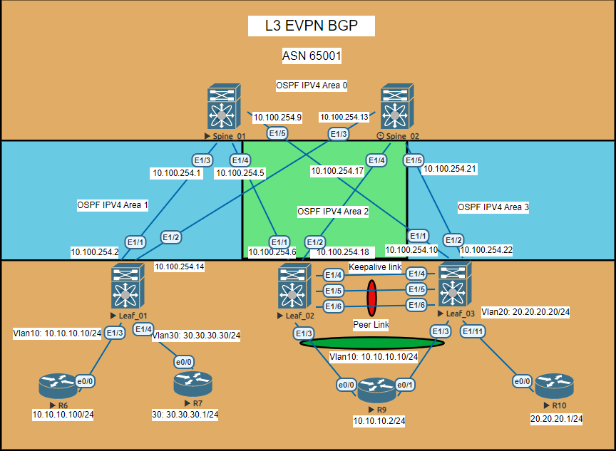
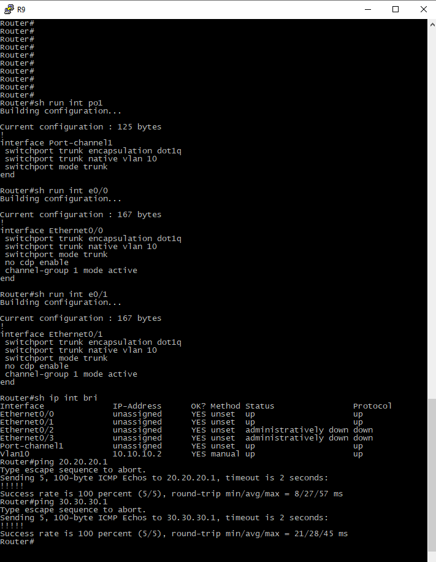

# Использование VPC в VxLan EVPN

```python
 Лаболаторная работа как продолжение предыдущей. Полные конфиги представлены в каталоге Config
Здесь будут основные настройки Leaf_02 Leaf_03 и Сервера подключенного к двум коммутаторам


```
# Схема сети



# итог работы VPC


# Маршрут с Leaf_01 в сторону R9 и R10
используется secondary IP интерфейса Loopbak100 в качестве nexthop
```python
Route Distinguisher: 3.3.3.3:3    (L3VNI 100222)
*>i[2]:[0]:[0]:[48]:[aabb.cc00.a000]:[32]:[20.20.20.1]/272
                      100.100.100.23                    100          0 i
*>i[2]:[0]:[0]:[48]:[aabb.cc80.9000]:[32]:[10.10.10.2]/272
                      100.100.100.23                    100          0 i
```

# config Leaf_01
необходимые настройки для VPC согласно схеме

```python
spanning-tree vlan 1-200 priority 4096

vrf context VPC

vpc domain 1
  peer-switch
  role priority 5
  peer-keepalive destination 1.1.1.1 source 1.1.1.2 vrf VPC
  delay restore 10
  peer-gateway
  ip arp synchronize

interface port-channel1
  description To_SRV
  switchport mode trunk
  switchport trunk native vlan 10
  vpc 1

interface port-channel2
  description To_peer-link_Leaf_3
  switchport mode trunk
  spanning-tree port type network
  vpc peer-link

interface Ethernet1/3
  switchport mode trunk
  switchport trunk native vlan 10
  channel-group 1 mode active

interface Ethernet1/4
  description MGMT_VPC
  no switchport
  vrf member VPC
  ip address 1.1.1.2/30
  no shutdown

interface Ethernet1/5
  lacp rate fast
  switchport mode trunk
  channel-group 2 mode active

interface Ethernet1/6
  lacp rate fast
  switchport mode trunk
  channel-group 2 mode active

interface loopback100
  ip address 100.100.100.2/32
  ip address 100.100.100.23/32 secondary
  ip router ospf 1 area 0.0.0.2

```

# config Leaf_02
необходимые настройки для VPC согласно схеме

```python

vrf context VPC

vpc domain 1
  peer-switch
  role priority 5
  peer-keepalive destination 1.1.1.2 source 1.1.1.1 vrf VPC
  delay restore 10
  peer-gateway
  ip arp synchronize

interface port-channel1
  description To_SRV
  switchport mode trunk
  switchport trunk native vlan 10
  vpc 1

interface port-channel2
  description To_peer-link_Leaf_2
  switchport mode trunk
  spanning-tree port type network
  vpc peer-link

interface Ethernet1/3
  switchport mode trunk
  switchport trunk native vlan 10
  channel-group 1 mode active

interface Ethernet1/4
  description MGMT_VPC
  no switchport
  vrf member VPC
  ip address 1.1.1.1/30
  no shutdown

interface Ethernet1/5
  lacp rate fast
  switchport mode trunk
  channel-group 2 mode active

interface Ethernet1/6
  lacp rate fast
  switchport mode trunk
  channel-group 2 mode active

interface loopback100
  ip address 100.100.100.2/32
  ip address 100.100.100.23/32 secondary
  ip router ospf 1 area 0.0.0.2

```

# Вывод команд Leaf_01-02 идентичны
```python


sh vpc
Legend:
                (*) - local vPC is down, forwarding via vPC peer-link

vPC domain id                     : 1   
Peer status                       : peer adjacency formed ok      
vPC keep-alive status             : peer is alive                 
Configuration consistency status  : success 
Per-vlan consistency status       : success                       
Type-2 consistency status         : success 
vPC role                          : secondary, operational primary
Number of vPCs configured         : 1   
Peer Gateway                      : Enabled
Dual-active excluded VLANs        : -
Graceful Consistency Check        : Enabled
Auto-recovery status              : Disabled
Delay-restore status              : Timer is off.(timeout = 10s)
Delay-restore SVI status          : Timer is off.(timeout = 10s)
Operational Layer3 Peer-router    : Disabled
Virtual-peerlink mode             : Disabled

vPC Peer-link status
---------------------------------------------------------------------
id    Port   Status Active vlans    
--    ----   ------ -------------------------------------------------
1     Po2    up     1,10,20,30,222                                              
         

vPC status
----------------------------------------------------------------------------
Id    Port          Status Consistency Reason                Active vlans
--    ------------  ------ ----------- ------                ---------------
1     Po1           up     success     success               1,10,20,30,222     


sh vpc consistency-parameters global 

    Legend:
        Type 1 : vPC will be suspended in case of mismatch

Name                        Type  Local Value            Peer Value             
-------------               ----  ---------------------- -----------------------
STP MST Simulate PVST       1     Enabled                Enabled               
STP Port Type, Edge         1     Normal, Disabled,      Normal, Disabled,     
BPDUFilter, Edge BPDUGuard        Disabled               Disabled              
STP MST Region Name         1     ""                     ""                    
STP Disabled                1     None                   None                  
STP Mode                    1     Rapid-PVST             Rapid-PVST            
STP Bridge Assurance        1     Enabled                Enabled               
STP Loopguard               1     Disabled               Disabled              
STP MST Region Instance to  1                                                  
 VLAN Mapping                                                                  
STP MST Region Revision     1     0                      0                     
Interface-vlan admin up     2     10,20,30,222           10,20,30,222          
Interface-vlan routing      2     1,10,20,30,222         1,10,20,30,222        
capability                                                                     
Nve1 Adm St, Src Adm St,    1     Up, Up,                Up, Up,               
Sec IP, Host Reach, VMAC          100.100.100.23, CP,    100.100.100.23, CP,   
Adv, SA,mcast l2, mcast           FALSE, Disabled,       FALSE, Disabled,      
l3, IR BGP,MS Adm St, Reo         0.0.0.0, 0.0.0.0,      0.0.0.0, 0.0.0.0,     
                                  Disabled, Down,        Disabled, Down,       
                                  0.0.0.0                0.0.0.0               
Xconnect Vlans              1                                                  
QoS (Cos)                   2     ([0-7], [], [], [],    ([0-7], [], [], [],   
                                  [], [], [], [])        [], [], [], [])       
Network QoS (MTU)           2     (1500, 1500, 1500,     (1500, 1500, 1500,    
                                  1500, 0, 0, 0, 0)      1500, 0, 0, 0, 0)     
Network Qos (Pause:         2     (F, F, F, F, F, F, F,  (F, F, F, F, F, F, F, 
T->Enabled, F->Disabled)          F)                     F)                    
Input Queuing (Bandwidth)   2     (0, 0, 0, 0, 0, 0, 0,  (0, 0, 0, 0, 0, 0, 0, 
                                  0)                     0)                    
Input Queuing (Absolute     2     (F, F, F, F, F, F, F,  (F, F, F, F, F, F, F, 
Priority: T->Enabled,             F)                     F)                    
F->Disabled)                                                                   
Output Queuing (Bandwidth   2     (100, 0, 0, 0, 0, 0,   (100, 0, 0, 0, 0, 0,  
Remaining)                        0, 0)                  0, 0)                 
Output Queuing (Absolute    2     (F, F, F, T, F, F, F,  (F, F, F, T, F, F, F, 
Priority: T->Enabled,             F)                     F)                    
F->Disabled)                                                                   
Allowed VLANs               -     1,10,20,30,222         1,10,20,30,222        
Local suspended VLANs       -     -                      -            

```