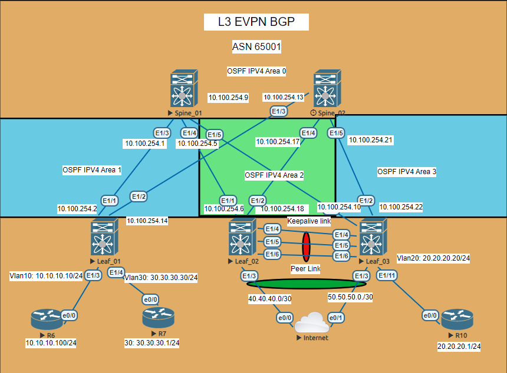

# Передача суммарных префиксов через EVPN route-type 5

# Схема сети для передачи маршрутов из вне в Overlay



# Данная лаболаторная работа как продолжение работы №7 


# Полные конфиги в каталоге Config
# Настройки для Leaf_02

```python

interface Ethernet1/3
  no switchport
  vrf member CCCP
  ip address 40.40.40.1/30
  no shutdown


  router bgp 65001
  router-id 4.4.4.4
  timers bgp 3 9
  reconnect-interval 10
  log-neighbor-changes
  address-family ipv4 unicast
  address-family l2vpn evpn
    maximum-paths 10
  template peer SPINES
    bfd
    remote-as 65001
    update-source loopback0
    timers 6 9
    address-family l2vpn evpn
      send-community
      send-community extended
  neighbor 10.1.1.1
    inherit peer SPINES
  neighbor 10.1.1.2
    inherit peer SPINES
  vrf CCCP
    address-family ipv4 unicast
    neighbor 40.40.40.2
      remote-as 888888
      address-family ipv4 unicast
evpn
  vni 10010 l2
    rd auto
    route-target import auto
    route-target export auto
  vni 100222 l2
    rd auto
    route-target import auto
    route-target export auto
vrf context CCCP
  rd auto
  address-family ipv4 unicast
    route-target both auto
```

# Настройки для Leaf_03

```python
interface Ethernet1/3
  no switchport
  vrf member CCCP
  ip address 50.50.50.1/30
  no shutdown


router bgp 65001
  router-id 5.5.5.5
  timers bgp 3 9
  reconnect-interval 10
  log-neighbor-changes
  address-family ipv4 unicast
  address-family l2vpn evpn
    maximum-paths 10
  template peer SPINES
    bfd
    remote-as 65001
    update-source loopback0
    timers 6 9
    address-family l2vpn evpn
      send-community
      send-community extended
  neighbor 10.1.1.1
    inherit peer SPINES
  neighbor 10.1.1.2
    inherit peer SPINES
  vrf CCCP
    address-family ipv4 unicast
    neighbor 50.50.50.2
      remote-as 888888
      address-family ipv4 unicast
evpn
  vni 10020 l2
    rd auto
    route-target import auto
    route-target export auto
  vni 100222 l2
    rd auto
    route-target import auto
    route-target export auto
vrf context CCCP
  rd auto
  address-family ipv4 unicast
    route-target both auto
```