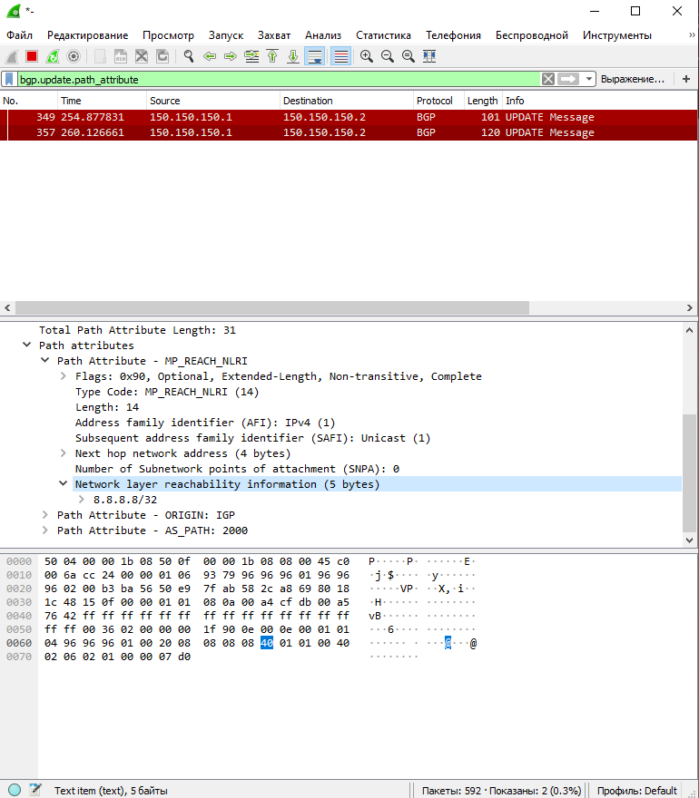

# Передача маршрутов через EVPN route-type 5

# Схема сети для передачи маршрутов из вне в Overlay


# Захват траффика с Leaf_02 int e1/3


# Данная лаболаторная работа как продолжение работы №7 


# Полные конфиги в каталоге Config

# Краткий вывод команд

```python
Spine_01# sh ip int bri

IP Interface Status for VRF "default"(1)
Interface            IP Address      Interface Status
Lo0                  10.1.1.1        protocol-up/link-up/admin-up       
Lo1                  10.10.1.1       protocol-up/link-up/admin-up       
Eth1/1               10.100.254.1    protocol-up/link-up/admin-up       
Eth1/2               10.100.254.5    protocol-up/link-up/admin-up       
Eth1/3               10.100.254.9    protocol-up/link-up/admin-up


Spine_01# sh bgp l2 evpn summary 
BGP summary information for VRF default, address family L2VPN EVPN
BGP router identifier 1.1.1.1, local AS number 65001
BGP table version is 83, L2VPN EVPN config peers 3, capable peers 3
14 network entries and 14 paths using 3416 bytes of memory
BGP attribute entries [8/1376], BGP AS path entries [1/6]
BGP community entries [0/0], BGP clusterlist entries [0/0]

Neighbor        V    AS MsgRcvd MsgSent   TblVer  InQ OutQ Up/Down  State/PfxRcd
10.3.1.1        4 65001    9175    9179       83    0    0 15:17:45 2         
10.4.1.1        4 65001    3408    3396       83    0    0 02:25:00 6         
10.5.1.1        4 65001    3454    3440       83    0    0 02:25:19 6  

Spine_01# sh ip route ospf-1 
IP Route Table for VRF "default"
'*' denotes best ucast next-hop
'**' denotes best mcast next-hop
'[x/y]' denotes [preference/metric]
'%<string>' in via output denotes VRF <string>

10.3.1.1/32, ubest/mbest: 1/0
    *via 10.100.254.2, Eth1/1, [110/41], 16:18:49, ospf-1, intra
10.4.1.1/32, ubest/mbest: 1/0
    *via 10.100.254.6, Eth1/2, [110/41], 03:26:14, ospf-1, intra
10.5.1.1/32, ubest/mbest: 1/0
    *via 10.100.254.10, Eth1/3, [110/41], 03:26:22, ospf-1, intra
10.100.254.12/30, ubest/mbest: 1/0
    *via 10.100.254.2, Eth1/1, [110/80], 16:18:49, ospf-1, intra
10.100.254.16/30, ubest/mbest: 1/0
    *via 10.100.254.6, Eth1/2, [110/80], 03:26:14, ospf-1, intra
10.100.254.20/30, ubest/mbest: 1/0
    *via 10.100.254.10, Eth1/3, [110/80], 03:26:22, ospf-1, intra
100.100.100.1/32, ubest/mbest: 1/0
    *via 10.100.254.2, Eth1/1, [110/41], 16:18:49, ospf-1, intra
100.100.100.2/32, ubest/mbest: 1/0
    *via 10.100.254.6, Eth1/2, [110/41], 03:23:19, ospf-1, intra
100.100.100.3/32, ubest/mbest: 1/0
    *via 10.100.254.10, Eth1/3, [110/41], 03:23:19, ospf-1, intra
100.100.100.23/32, ubest/mbest: 2/0
    *via 10.100.254.6, Eth1/2, [110/41], 03:23:19, ospf-1, intra
    *via 10.100.254.10, Eth1/3, [110/41], 03:23:19, ospf-1, intra


Leaf_01# sh ip int bri

IP Interface Status for VRF "default"(1)
Interface            IP Address      Interface Status
Lo0                  10.3.1.1        protocol-up/link-up/admin-up       
Lo100                100.100.100.1   protocol-up/link-up/admin-up       
Eth1/1               10.100.254.2    protocol-up/link-up/admin-up       
Eth1/2               10.100.254.14   protocol-up/link-up/admin-up       


Leaf_01# sh bgp l2 e s
BGP summary information for VRF default, address family L2VPN EVPN
BGP router identifier 3.3.3.3, local AS number 65001
BGP table version is 225, L2VPN EVPN config peers 2, capable peers 2
16 network entries and 29 paths using 4384 bytes of memory
BGP attribute entries [16/2752], BGP AS path entries [1/6]
BGP community entries [0/0], BGP clusterlist entries [3/12]

Neighbor        V    AS MsgRcvd MsgSent   TblVer  InQ OutQ Up/Down  State/PfxRcd
10.1.1.1        4 65001    9596    9549      225    0    0 15:55:23 9         
10.1.1.2        4 65001   21014   20970      225    0    0 00:22:21 9     

Leaf_01# sh ip ro ospf-1 
IP Route Table for VRF "default"
'*' denotes best ucast next-hop
'**' denotes best mcast next-hop
'[x/y]' denotes [preference/metric]
'%<string>' in via output denotes VRF <string>

10.1.1.1/32, ubest/mbest: 1/0
    *via 10.100.254.1, Eth1/1, [110/41], 16:20:04, ospf-1, inter
10.4.1.1/32, ubest/mbest: 1/0
    *via 10.100.254.1, Eth1/1, [110/81], 03:27:29, ospf-1, inter
10.5.1.1/32, ubest/mbest: 1/0
    *via 10.100.254.1, Eth1/1, [110/81], 03:27:37, ospf-1, inter
10.100.254.4/30, ubest/mbest: 1/0
    *via 10.100.254.1, Eth1/1, [110/80], 12:34:58, ospf-1, inter
10.100.254.8/30, ubest/mbest: 1/0
    *via 10.100.254.1, Eth1/1, [110/80], 16:11:26, ospf-1, inter
10.100.254.16/30, ubest/mbest: 1/0
    *via 10.100.254.1, Eth1/1, [110/120], 00:20:31, ospf-1, inter
10.100.254.20/30, ubest/mbest: 1/0
    *via 10.100.254.1, Eth1/1, [110/120], 00:20:31, ospf-1, inter
100.100.100.2/32, ubest/mbest: 1/0
    *via 10.100.254.1, Eth1/1, [110/81], 03:24:34, ospf-1, inter
100.100.100.3/32, ubest/mbest: 1/0
    *via 10.100.254.1, Eth1/1, [110/81], 03:24:34, ospf-1, inter
100.100.100.23/32, ubest/mbest: 1/0
    *via 10.100.254.1, Eth1/1, [110/81], 03:24:34, ospf-1, inter


```