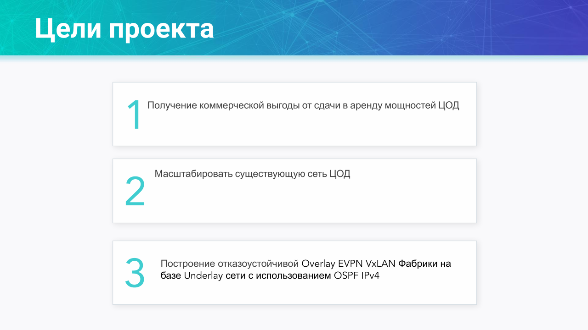
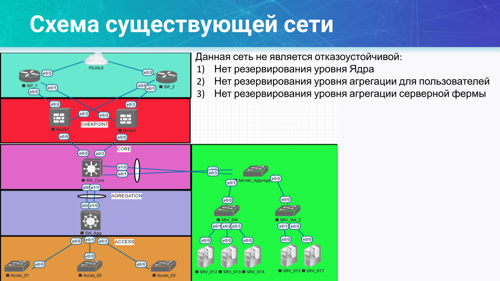
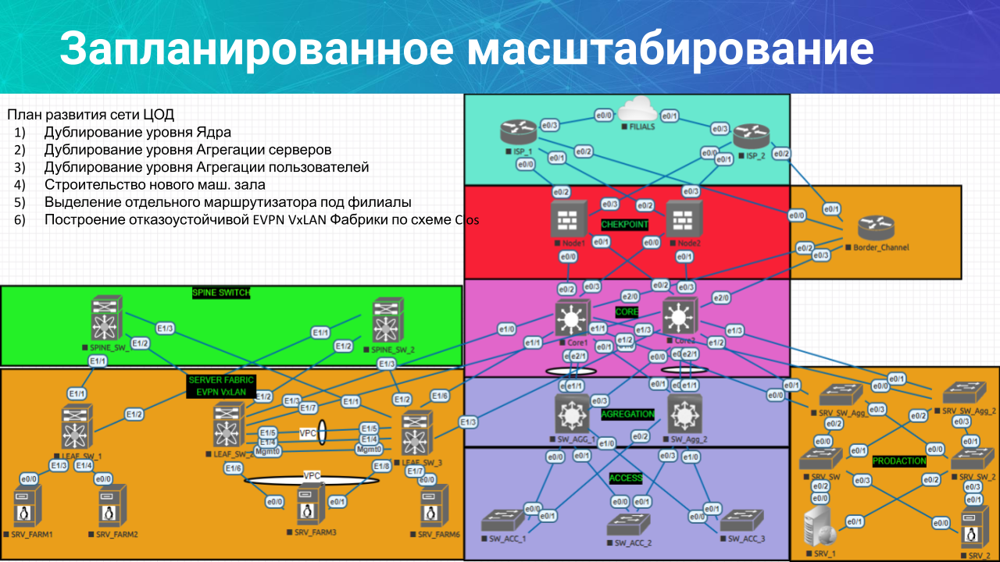
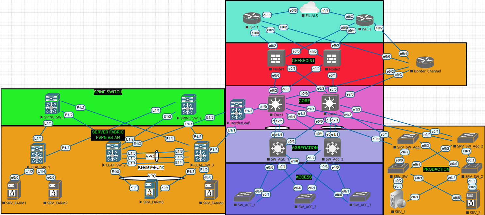

# Добавлен Border_Leaf


# Вброс внешнего маршрута в Оверлей


# Адресация находится в каталоге Config
# Полные файлы конфигураций в каталоге Config

# В проекте кратко показана работа нового машинного зала ЦОД

# Краткий вывод команд

# Spine 1
```python
Spine_01# sh ip int bri

IP Interface Status for VRF "default"(1)
Interface            IP Address      Interface Status
Lo0                  10.1.1.1        protocol-up/link-up/admin-up       
Lo1                  10.10.1.1       protocol-up/link-up/admin-up       
Eth1/1               10.100.254.1    protocol-up/link-up/admin-up       
Eth1/2               10.100.254.5    protocol-up/link-up/admin-up       
Eth1/3               10.100.254.9    protocol-up/link-up/admin-up


Spine_01# sh ip ro
IP Route Table for VRF "default"
'*' denotes best ucast next-hop
'**' denotes best mcast next-hop
'[x/y]' denotes [preference/metric]
'%<string>' in via output denotes VRF <string>

10.1.1.1/32, ubest/mbest: 2/0, attached
    *via 10.1.1.1, Lo0, [0/0], 5d21h, local
    *via 10.1.1.1, Lo0, [0/0], 5d21h, direct
10.1.1.2/32, ubest/mbest: 3/0
    *via 10.100.254.2, Eth1/1, [110/81], 14:29:31, ospf-1, inter
    *via 10.100.254.6, Eth1/2, [110/81], 02:24:28, ospf-1, inter
    *via 10.100.254.10, Eth1/3, [110/81], 02:24:36, ospf-1, inter
10.3.1.1/32, ubest/mbest: 1/0
    *via 10.100.254.2, Eth1/1, [110/41], 15:17:03, ospf-1, intra
10.4.1.1/32, ubest/mbest: 1/0
    *via 10.100.254.6, Eth1/2, [110/41], 02:24:28, ospf-1, intra
10.5.1.1/32, ubest/mbest: 1/0
    *via 10.100.254.10, Eth1/3, [110/41], 02:24:36, ospf-1, intra
10.10.1.1/32, ubest/mbest: 2/0, attached
    *via 10.10.1.1, Lo1, [0/0], 5d21h, local
    *via 10.10.1.1, Lo1, [0/0], 5d21h, direct
10.100.254.0/30, ubest/mbest: 1/0, attached
    *via 10.100.254.1, Eth1/1, [0/0], 15:17:17, direct
10.100.254.1/32, ubest/mbest: 1/0, attached
    *via 10.100.254.1, Eth1/1, [0/0], 15:17:17, local
10.100.254.4/30, ubest/mbest: 1/0, attached
    *via 10.100.254.5, Eth1/2, [0/0], 15:08:54, direct
10.100.254.5/32, ubest/mbest: 1/0, attached
    *via 10.100.254.5, Eth1/2, [0/0], 15:08:54, local
10.100.254.8/30, ubest/mbest: 1/0, attached
    *via 10.100.254.9, Eth1/3, [0/0], 15:08:26, direct
10.100.254.9/32, ubest/mbest: 1/0, attached
    *via 10.100.254.9, Eth1/3, [0/0], 15:08:26, local
10.100.254.12/30, ubest/mbest: 1/0
    *via 10.100.254.2, Eth1/1, [110/80], 15:17:03, ospf-1, intra
10.100.254.16/30, ubest/mbest: 1/0
    *via 10.100.254.6, Eth1/2, [110/80], 02:24:28, ospf-1, intra
10.100.254.20/30, ubest/mbest: 1/0
    *via 10.100.254.10, Eth1/3, [110/80], 02:24:36, ospf-1, intra
100.100.100.1/32, ubest/mbest: 1/0
    *via 10.100.254.2, Eth1/1, [110/41], 15:17:03, ospf-1, intra
100.100.100.2/32, ubest/mbest: 1/0
    *via 10.100.254.6, Eth1/2, [110/41], 02:21:33, ospf-1, intra
100.100.100.3/32, ubest/mbest: 1/0
    *via 10.100.254.10, Eth1/3, [110/41], 02:21:33, ospf-1, intra
100.100.100.23/32, ubest/mbest: 2/0
    *via 10.100.254.6, Eth1/2, [110/41], 02:21:33, ospf-1, intra
    *via 10.100.254.10, Eth1/3, [110/41], 02:21:33, ospf-1, intra


Spine_01# sh bgp l2 evpn summary 
BGP summary information for VRF default, address family L2VPN EVPN
BGP router identifier 1.1.1.1, local AS number 65001
BGP table version is 83, L2VPN EVPN config peers 3, capable peers 3
14 network entries and 14 paths using 3416 bytes of memory
BGP attribute entries [8/1376], BGP AS path entries [1/6]
BGP community entries [0/0], BGP clusterlist entries [0/0]

Neighbor        V    AS MsgRcvd MsgSent   TblVer  InQ OutQ Up/Down  State/PfxRcd
10.3.1.1        4 65001    9175    9179       83    0    0 15:17:45 2         
10.4.1.1        4 65001    3408    3396       83    0    0 02:25:00 6         
10.5.1.1        4 65001    3454    3440       83    0    0 02:25:19 6         

```
# Leaf 2

```python
Leaf_02# sh ip int bri

IP Interface Status for VRF "default"(1)
Interface            IP Address      Interface Status
Lo0                  10.4.1.1        protocol-up/link-up/admin-up       
Lo100                100.100.100.2   protocol-up/link-up/admin-up       
Eth1/1               10.100.254.6    protocol-up/link-up/admin-up       
Eth1/2               10.100.254.18   protocol-up/link-up/admin-up 

# Связность с Border_Leaf
Leaf_02#  sh ip bgp su
Neighbor        V    AS MsgRcvd MsgSent   TblVer  InQ OutQ Up/Down  State/PfxRcd
150.150.150.1   4  2000       0       0        0    0    0    3d10h Idle     

Leaf_02# sh ip ro
IP Route Table for VRF "default"
'*' denotes best ucast next-hop
'**' denotes best mcast next-hop
'[x/y]' denotes [preference/metric]
'%<string>' in via output denotes VRF <string>

10.1.1.1/32, ubest/mbest: 1/0
    *via 10.100.254.5, Eth1/1, [110/41], 03:09:23, ospf-1, inter
10.3.1.1/32, ubest/mbest: 1/0
    *via 10.100.254.5, Eth1/1, [110/81], 03:09:23, ospf-1, inter
10.4.1.1/32, ubest/mbest: 2/0, attached
    *via 10.4.1.1, Lo0, [0/0], 12:07:27, local
    *via 10.4.1.1, Lo0, [0/0], 12:07:27, direct
10.5.1.1/32, ubest/mbest: 1/0
    *via 10.100.254.5, Eth1/1, [110/81], 03:09:23, ospf-1, inter
10.100.254.0/30, ubest/mbest: 1/0
    *via 10.100.254.5, Eth1/1, [110/80], 03:09:23, ospf-1, inter
10.100.254.4/30, ubest/mbest: 1/0, attached
    *via 10.100.254.6, Eth1/1, [0/0], 03:09:36, direct
10.100.254.6/32, ubest/mbest: 1/0, attached
    *via 10.100.254.6, Eth1/1, [0/0], 03:09:36, local
10.100.254.8/30, ubest/mbest: 1/0
    *via 10.100.254.5, Eth1/1, [110/80], 03:09:23, ospf-1, inter
10.100.254.12/30, ubest/mbest: 1/0
    *via 10.100.254.5, Eth1/1, [110/120], 00:02:25, ospf-1, inter
10.100.254.16/30, ubest/mbest: 1/0, attached
    *via 10.100.254.18, Eth1/2, [0/0], 03:09:36, direct
10.100.254.18/32, ubest/mbest: 1/0, attached
    *via 10.100.254.18, Eth1/2, [0/0], 03:09:36, local
10.100.254.20/30, ubest/mbest: 1/0
    *via 10.100.254.5, Eth1/1, [110/120], 00:02:25, ospf-1, inter
100.100.100.1/32, ubest/mbest: 1/0
    *via 10.100.254.5, Eth1/1, [110/81], 03:09:23, ospf-1, inter
100.100.100.2/32, ubest/mbest: 2/0, attached
    *via 100.100.100.2, Lo100, [0/0], 03:06:26, local
    *via 100.100.100.2, Lo100, [0/0], 03:06:26, direct
100.100.100.3/32, ubest/mbest: 1/0
    *via 10.100.254.5, Eth1/1, [110/81], 03:06:26, ospf-1, inter
100.100.100.23/32, ubest/mbest: 2/0, attached
    *via 100.100.100.23, Lo100, [0/0], 03:06:26, local
    *via 100.100.100.23, Lo100, [0/0], 03:06:26, direct

# в VRF CCCP происходит вброс внешнего маршрута 8.8.8.8/32 

Leaf_02# sh ip route vrf CCCP
IP Route Table for VRF "CCCP"
'*' denotes best ucast next-hop
'**' denotes best mcast next-hop
'[x/y]' denotes [preference/metric]
'%<string>' in via output denotes VRF <string>

8.8.8.8/32, ubest/mbest: 1/0
    *via 150.150.150.1, [20/0], 02:06:24, bgp-65001, external, tag 2000
10.10.10.0/24, ubest/mbest: 1/0, attached
    *via 10.10.10.10, Vlan10, [0/0], 12:08:54, direct
10.10.10.10/32, ubest/mbest: 1/0, attached
    *via 10.10.10.10, Vlan10, [0/0], 12:08:54, local
20.20.20.0/24, ubest/mbest: 1/0, attached
    *via 20.20.20.20, Vlan20, [0/0], 12:08:54, direct
20.20.20.20/32, ubest/mbest: 1/0, attached
    *via 20.20.20.20, Vlan20, [0/0], 12:08:54, local
30.30.30.0/24, ubest/mbest: 1/0, attached
    *via 30.30.30.30, Vlan30, [0/0], 12:08:54, direct
30.30.30.30/32, ubest/mbest: 1/0, attached
    *via 30.30.30.30, Vlan30, [0/0], 12:08:54, local
150.150.150.0/30, ubest/mbest: 1/0, attached
    *via 150.150.150.2, Eth1/3, [0/0], 03:11:02, direct
150.150.150.2/32, ubest/mbest: 1/0, attached
    *via 150.150.150.2, Eth1/3, [0/0], 03:11:02, local


```

# Работа VPC пары
```python
Leaf_02# sh vpc
Legend:
                (*) - local vPC is down, forwarding via vPC peer-link

vPC domain id                     : 1   
Peer status                       : peer adjacency formed ok      
vPC keep-alive status             : peer is alive                 
Configuration consistency status  : success 
Per-vlan consistency status       : success                       
Type-2 consistency status         : success 
vPC role                          : primary                       
Number of vPCs configured         : 1   
Peer Gateway                      : Enabled
Dual-active excluded VLANs        : -
Graceful Consistency Check        : Enabled
Auto-recovery status              : Disabled
Delay-restore status              : Timer is off.(timeout = 10s)
Delay-restore SVI status          : Timer is off.(timeout = 10s)
Operational Layer3 Peer-router    : Disabled
Virtual-peerlink mode             : Disabled

vPC Peer-link status
---------------------------------------------------------------------
id    Port   Status Active vlans    
--    ----   ------ -------------------------------------------------
1     Po2    up     1,10,20,30,222                                              
         

vPC status
----------------------------------------------------------------------------
Id    Port          Status Consistency Reason                Active vlans
--    ------------  ------ ----------- ------                ---------------
1     Po1           up     success     success               1,10,20,30,222     
         


```

# Выводы

```python
1. Для построения Ubderlay использован протокол OSPF IPv4 
2. Для построения Overlay выбрана технология VxLAN EVPN с сигнальным протоколом BGP
3. Для отказоустойчивости использована технология VPC
4. Для вброса внешних маршрутов в Overlay использован протокол BGP и дополнительный коммутатор Border_Leaf

```

